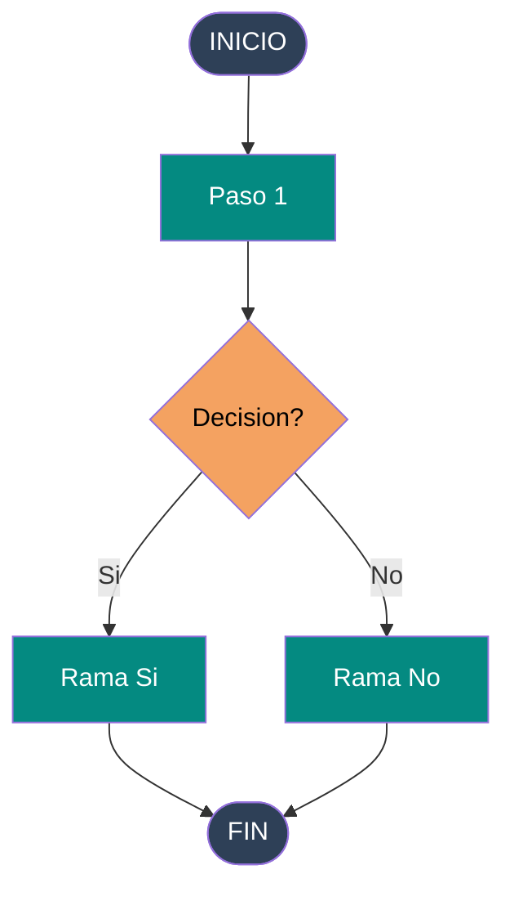

# Proyecto: Documentacion Diagramas TRMM/GPM
> Archivo de contexto para Claude Code — colócalo en la raíz del repositorio

## Descripcion del proyecto

Repositorio de documentación técnica con diagramas Mermaid para el pipeline de
descarga y procesamiento de datos de precipitación satelital TRMM y GPM desde
Google Earth Engine (GEE). Los diagramas se visualizan nativamente en GitHub y
localmente en VS Code.

## Estructura del repositorio

```
proyecto-diagramas-trmm-gpm/
├── CLAUDE.md                        ← este archivo (contexto para Claude Code)
├── README.md                        ← diagrama principal + índice
├── diagramas/
│   ├── 01_flujo_descarga.md         ← flujo completo de descarga TRMM/GPM
│   ├── 02_flujo_procesamiento.md    ← normalización y conversión de unidades
│   ├── 03_arquitectura_datos.md     ← estructura de carpetas y archivos .tif
│   ├── 04_pipeline_gee.md           ← colecciones GEE, filtros, exportación
│   └── 05_decisiones_clave.md       ← árbol de decisiones del pipeline
├── scripts/
│   └── validar_mermaid.py           ← script para validar sintaxis localmente
└── .vscode/
    └── extensions.json              ← extensiones recomendadas para el proyecto
```

## Stack tecnológico

- **Diagramas:** Mermaid (sintaxis `.md` con bloques ```mermaid)
- **Renderizado local:** VS Code + extensión "Markdown Preview Mermaid Support"
- **Renderizado remoto:** GitHub (soporte nativo en archivos .md)
- **Control de versiones:** Git + GitHub
- **Validación opcional:** @mermaid-js/mermaid-cli (Node.js)

## Convenciones de diagramas

### Tipos de nodos usados

```
([texto])     → Terminator  (INICIO / FIN)
[texto]       → Process     (pasos normales)
[/texto/]     → Preparation (bucles FOR)
{texto}       → Decision    (condiciones)
```

### Paleta de colores estándar del proyecto

| Elemento         | Color fill | Color texto | Uso                        |
|------------------|-----------|-------------|----------------------------|
| Terminadores     | `#2E4057` | `#ffffff`   | INICIO / FIN               |
| Procesos         | `#048A81` | `#ffffff`   | Pasos del pipeline         |
| Bucles           | `#54478C` | `#ffffff`   | FOR año / FOR mes          |
| Decisiones       | `#F4A261` | `#000000`   | Condiciones / bifurcaciones|
| Colección TRMM   | `#2196F3` | `#ffffff`   | Fuente datos <= 2014       |
| Colección GPM    | `#9C27B0` | `#ffffff`   | Fuente datos > 2014        |
| Error / sin datos| `#E63946` | `#ffffff`   | Rutas de error             |
| Omitir / skip    | `#607D8B` | `#ffffff`   | Archivos ya existentes     |
| OK / éxito       | `#4CAF50` | `#ffffff`   | Resultado exitoso          |

### Plantilla base para cada diagrama nuevo

````markdown
# Título del Diagrama

Descripción breve del flujo documentado.



## Notas

- Nota técnica relevante
- Referencia a colección GEE o script Python relacionado
````

## Contexto técnico del dominio

### Pipeline TRMM/GPM

- **Fuente de datos:** Google Earth Engine (GEE)
- **Colección TRMM:** `TRMM/3B43V7` — cubre 1997-08 a 2019-12 (resolución ~25km)
- **Colección GPM:** `NASA/GPM_L3/IMERG_V07` — cubre desde 2000-06 a presente
- **Punto de corte:** año <= 2014 usa TRMM, año > 2014 usa GPM
- **Área de interés:** Colombia (cargada desde `FAO/GAUL/2015/level0`)
- **Unidades:** tasa mm/hr × horas del mes = precipitación total mm/mes
- **Escala de exportación:** 10,000 metros (10 km)
- **Proyección:** EPSG:4326
- **Formato de salida:** GeoTIFF (.tif), organizados por año/mes

### Estructura de carpetas de salida esperada

```
datos_precipitacion/
├── 1998/
│   ├── precipitacion_199801.tif
│   ├── precipitacion_199802.tif
│   └── ...
├── 1999/
└── ...
2026/
    └── precipitacion_202604.tif
```

### Scripts Python relacionados

- `galinet_nav_capture.py` — captura RTCM3 y generación RINEX (proyecto GALINET)
- Scripts ArcPy para procesamiento catastral ANT
- Pipeline GEE en Python con `earthengine-api`

## Instrucciones para Claude Code

### Al crear un nuevo diagrama

1. Usar la plantilla base definida arriba
2. Aplicar la paleta de colores estándar del proyecto
3. Nombrar el archivo con prefijo numérico: `NN_nombre_descriptivo.md`
4. Agregar una sección `## Notas` con referencias técnicas relevantes
5. Actualizar el índice en `README.md`

### Al modificar un diagrama existente

1. Mantener la paleta de colores consistente
2. No cambiar IDs de nodos existentes si hay referencias externas
3. Documentar el cambio en la sección `## Changelog` del archivo

### Al validar sintaxis Mermaid

```bash
# Instalar CLI de Mermaid (requiere Node.js)
npm install -g @mermaid-js/mermaid-cli

# Generar PNG desde un archivo .md (extraer bloque mermaid primero)
mmdc -i diagrama.mmd -o diagrama.png

# O usar el script del proyecto
python scripts/validar_mermaid.py diagramas/01_flujo_descarga.md
```

### Comandos Git útiles para este proyecto

```bash
# Ver qué diagramas han cambiado
git diff --name-only diagramas/

# Commit con convención de mensajes
git commit -m "diagrama: actualizar flujo descarga GPM post-2014"
git commit -m "diagrama: agregar pipeline procesamiento raster"

# Push y verificar en GitHub
git push origin main
# Abrir en browser: https://github.com/TU_USUARIO/proyecto-diagramas-trmm-gpm
```

## Configuracion VS Code recomendada

Archivo `.vscode/extensions.json`:

```json
{
  "recommendations": [
    "bierner.markdown-mermaid",
    "tomoyukim.vscode-mermaid-editor",
    "yzhang.markdown-all-in-one",
    "davidanson.vscode-markdownlint",
    "eamodio.gitlens"
  ]
}
```

Para previsualizar: `Ctrl+Shift+V` en cualquier archivo `.md`

## Referencias

- [Mermaid Docs — Flowchart](https://mermaid.js.org/syntax/flowchart.html)
- [GitHub Mermaid Support](https://github.blog/2022-02-14-include-diagrams-markdown-files-mermaid/)
- [GEE — TRMM/3B43V7](https://developers.google.com/earth-engine/datasets/catalog/TRMM_3B43V7)
- [GEE — GPM IMERG V07](https://developers.google.com/earth-engine/datasets/catalog/NASA_GPM_L3_IMERG_V07)
- [FAO GAUL Colombia](https://developers.google.com/earth-engine/datasets/catalog/FAO_GAUL_2015_level0)
