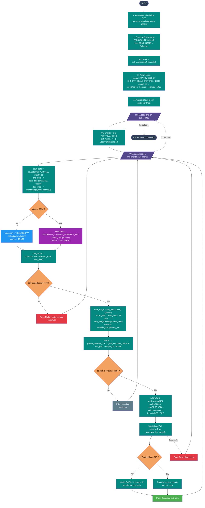

# 00 — Descarga Raster TRMM / GPM

Documenta el flujo del script
[`Codigos/00._Descarga_Raster_TRMM.py`](../Codigos/00._Descarga_Raster_TRMM.py),
encargado de descargar **precipitación mensual** para Colombia desde Google
Earth Engine (GEE) entre **1997-08 y 2026-04**, normalizada a unidades de
mm/mes y resolución de 10 km.

---

## Resumen del proceso

1. **Autenticación** e inicialización de GEE (proyecto `precipitaciones-459216`).
2. **Área de interés:** Colombia, desde `FAO/GAUL/2015/level0`.
3. **Bucle** anidado año → mes en el rango `1997-08` a `2026-04`.
4. **Selección de colección** según el año:
   - `year <= 2014` → `TRMM/3B43V7`
   - `year >= 2015` → `NASA/GPM_L3/IMERG_MONTHLY_V07`
5. **Normalización de unidades:** la tasa `mm/hr` se multiplica por
   `dias_mes * 24` para obtener el acumulado `mm/mes`.
6. **Exportación:** GeoTIFF a 10 km (EPSG:4326) vía `getDownloadURL` y
   `requests`.
7. Se omiten los meses **sin datos** y los archivos que **ya existen** en
   disco.

---

## Diagrama de flujo

> 📝 **Fuente editable:** [`00_descarga_raster_trmm_gpm.mmd`](./00_descarga_raster_trmm_gpm.mmd)
> — el bloque que sigue es una copia para que GitHub lo renderice. Si editas
> el `.mmd`, pega aquí el contenido actualizado (ver sección
> [Edición visual del diagrama](#edición-visual-del-diagrama)).



---

## Notas técnicas

### Colecciones GEE utilizadas

| Periodo cubierto | Colección | Banda usada | Unidad nativa |
|---|---|---|---|
| `year <= 2014` | [`TRMM/3B43V7`](https://developers.google.com/earth-engine/datasets/catalog/TRMM_3B43V7) | `precipitation` | mm/hr |
| `year >= 2015` | [`NASA/GPM_L3/IMERG_MONTHLY_V07`](https://developers.google.com/earth-engine/datasets/catalog/NASA_GPM_L3_IMERG_MONTHLY_V07) | `precipitation` | mm/hr |

> ⚠️ **Importante:** el script usa la versión **mensual** de IMERG
> (`IMERG_MONTHLY_V07`), no la diaria. Ambas colecciones devuelven la banda
> `precipitation` en `mm/hr`, por eso aplica la misma conversión.

### Conversión de unidades

```
mm_mes = (mm/hr) * dias_del_mes * 24
```

`dias_del_mes` se obtiene con `calendar.monthrange(year, month)[1]` (maneja
febrero y años bisiestos automáticamente).

### Parámetros de exportación

| Parámetro | Valor |
|---|---|
| `scale` | `10000` metros (10 km) |
| `crs` | `EPSG:4326` |
| `region` | `geometry.getInfo()['coordinates']` (bounds de Colombia) |
| `format` | `GEO_TIFF` |

### Mecanismos de robustez

- **`coll_period.size() == 0`** → se omite el mes con un mensaje
  `❌ No hay datos`.
- **`os.path.exists(out_path)`** → idempotencia: si el TIF ya existe se omite
  la descarga (`👍 ya existe`).
- **`try/except`** envolviendo `getDownloadURL` + `requests.get` → captura
  cualquier error de red o del servidor de GEE sin detener el bucle
  (`⛔ Error al procesar`).
- **Detección automática de ZIP** (`zipfile.is_zipfile`) → algunos endpoints
  de GEE devuelven el `.tif` empaquetado en `.zip`; el script extrae el primer
  `.tif` que encuentra.

### Estructura de salida

```
precipitacion_mensual_colombia_10km/
├── precip_mensual_1997_08_colombia_10km.tif
├── precip_mensual_1997_09_colombia_10km.tif
├── ...
├── precip_mensual_2014_12_colombia_10km.tif   ← último mes TRMM
├── precip_mensual_2015_01_colombia_10km.tif   ← primer mes GPM
├── ...
└── precip_mensual_2026_04_colombia_10km.tif
```

---

## Dependencias

```python
import ee                       # earthengine-api
import requests                 # descarga HTTP
import os, io, zipfile          # stdlib
from calendar import monthrange # dias del mes
```

Instalación:

```bash
pip install earthengine-api requests
earthengine authenticate
```

---

## Edición visual del diagrama

El archivo [`00_descarga_raster_trmm_gpm.mmd`](./00_descarga_raster_trmm_gpm.mmd)
contiene **solo el código Mermaid** (sin Markdown alrededor) para que puedas
editarlo en herramientas visuales:

### Opción 1 — mermaid.live (rápido, sin cuenta)

1. Abre https://mermaid.live
2. En el panel izquierdo, **borra el contenido por defecto**.
3. Abre `00_descarga_raster_trmm_gpm.mmd` en cualquier editor → copia todo →
   pégalo en mermaid.live.
4. La preview del centro se actualiza en vivo.
5. Para guardar los cambios: copia el código modificado de vuelta al `.mmd` y
   actualiza también el bloque ```` ```mermaid ```` de este `.md` para que
   GitHub lo renderice.

### Opción 2 — Mermaid Chart (drag & drop visual)

1. Crea cuenta gratis en https://www.mermaidchart.com
2. **New diagram → Import → Mermaid file** → sube el `.mmd`.
3. Cambia a modo *Visual editor* para mover nodos con el mouse.
4. Cuando termines: **Export → Mermaid code** → reemplaza el `.mmd` y el
   bloque en este `.md`.

### Opción 3 — VS Code (preview lateral local)

1. Instala la extensión recomendada
   [`tomoyukim.vscode-mermaid-editor`](https://marketplace.visualstudio.com/items?itemName=tomoyukim.vscode-mermaid-editor).
2. Abre el `.mmd` → `Ctrl+Shift+P` → **Mermaid Editor: Preview to the Side**.
3. Edita el `.mmd` y ve los cambios al instante.

> 🔁 **Importante:** mientras no haya un script de sincronización, debes
> mantener el `.mmd` y el bloque ```` ```mermaid ```` de este `.md`
> **idénticos**. El `.mmd` es la fuente editable; el bloque del `.md` es la
> copia que GitHub renderiza.
