# 01 — Gráfica IDEAM (estación pluviométrica)

Documenta el flujo del script
[`Codigos/01_Grafica_ideam.py`](../Codigos/01_Grafica_ideam.py),
encargado de **analizar la serie mensual de precipitación de una estación
IDEAM** y generar:

- 4 imágenes (PNG): gráfica principal, tabla intranual, tabla interanual y heatmap
- 1 informe (TXT) con 10 secciones de estadísticas, tendencias y recomendaciones

---

## Resumen del proceso

1. **Configurar** el nombre del sitio y las rutas (1 CSV de entrada, 5 salidas).
2. **Leer** el CSV mensual de IDEAM con codificación `latin-1`.
3. **Validar** columnas `AÑO`, `MES`, `VALOR` → si faltan, abortar.
4. **Limpiar** la serie: construir fecha, ordenar y descartar registros con
   valor cero (faltantes IDEAM).
5. **Calcular** la batería de estadísticas:
   - Media móvil 12 meses.
   - Tendencia lineal y polinómica (cambio por década).
   - Estadísticas mensuales (media, desviación, CV, etc.).
   - Identificación de meses húmedos/secos.
   - Estadísticas por décadas.
   - Percentiles anuales (P10, P25, P75, P90) y clasificación en 5 categorías.
   - Anomalías mensuales (absolutas y porcentuales).
   - Top 10 años más húmedos con sus 3 meses más lluviosos.
   - Períodos consecutivos por encima del P75.
6. **Generar** las 5 salidas (4 PNG + 1 TXT).

---

## Diagrama de flujo

> 📝 **Fuente editable:** [`01_grafica_ideam.mmd`](./01_grafica_ideam.mmd) —
> usa el script `scripts/sync_mmd.py` para reflejar cambios del `.mmd` en
> este bloque automáticamente.

```mermaid
flowchart TD
    S1([INICIO]) --> S2

    subgraph F1 ["Fase 1: Carga y validación de datos"]
      direction TB
      S2["Configurar nombre del sitio y rutas<br/>del CSV de entrada y de las salidas<br/>(4 PNG y 1 informe TXT)"]
      S3["Leer el CSV mensual de IDEAM<br/>(codificación latin-1)"]
      S4["Normalizar nombres de columnas<br/>(mayúsculas, sin espacios)"]
      D1{"¿Tiene las columnas<br/>AÑO, MES y VALOR ?"}
      FAIL["Reportar columnas faltantes<br/>y terminar el script"]
      S5["Construir columna de fecha<br/>y ordenar cronológicamente"]
      S6["Filtrar registros con valor 0<br/>(datos faltantes en IDEAM)"]

      S2 --> S3 --> S4 --> D1
      D1 -->|"No"| FAIL
      D1 -->|"Sí"| S5 --> S6
    end

    S6 --> S7

    subgraph F2 ["Fase 2: Cálculos estadísticos"]
      direction TB
      S7["Calcular media móvil de 12 meses<br/>(suaviza la serie temporal)"]
      S8["Ajustar tendencias lineal y polinómica<br/>(obtiene el cambio por década)"]
      S9["Calcular estadísticas mensuales<br/>(media, desviación, CV, mínimo, máximo)"]
      S10["Identificar meses húmedos y secos<br/>respecto a la media histórica"]
      S11["Calcular estadísticas por décadas"]
      S12["Calcular percentiles anuales<br/>(P10, P25, P75, P90)"]
      S13["Clasificar cada año en 5 categorías:<br/>muy húmedo · húmedo · normal ·<br/>seco · muy seco"]
      S14["Calcular anomalías mensuales<br/>(absolutas y porcentuales)"]
      S15["Analizar los 10 años más húmedos<br/>(con sus 3 meses más lluviosos)"]
      S16["Detectar períodos consecutivos<br/>por encima del P75 (de 2 meses o más)"]

      S7 --> S8 --> S9 --> S10 --> S11 --> S12 --> S13 --> S14 --> S15 --> S16
    end

    S16 --> O1

    subgraph F3 ["Fase 3: Generación de salidas"]
      direction TB
      O1["Generar gráfica principal (PNG)<br/>serie mensual + tendencias + anomalías"]
      O2["Generar tabla intranual (PNG)<br/>matriz año × mes coloreada<br/>por percentiles globales"]
      O3["Generar tabla interanual (PNG)<br/>matriz año × mes coloreada<br/>por percentiles de cada mes"]
      O4["Generar heatmap año × mes (PNG)"]
      O5["Generar informe completo (TXT)<br/>10 secciones: estadísticas, tendencias,<br/>conclusiones y recomendaciones"]
      O6["Mostrar resumen en consola"]

      O1 --> O2 --> O3 --> O4 --> O5 --> O6
    end

    O6 --> FIN
    FIN([FIN: archivos generados])

    style S1   fill:#2E4057,color:#fff
    style FIN  fill:#2E4057,color:#fff

    style S2   fill:#048A81,color:#fff
    style S3   fill:#048A81,color:#fff
    style S4   fill:#048A81,color:#fff
    style S5   fill:#048A81,color:#fff
    style S6   fill:#048A81,color:#fff
    style S7   fill:#048A81,color:#fff
    style S8   fill:#048A81,color:#fff
    style S9   fill:#048A81,color:#fff
    style S10  fill:#048A81,color:#fff
    style S11  fill:#048A81,color:#fff
    style S12  fill:#048A81,color:#fff
    style S13  fill:#048A81,color:#fff
    style S14  fill:#048A81,color:#fff
    style S15  fill:#048A81,color:#fff
    style S16  fill:#048A81,color:#fff
    style O1   fill:#048A81,color:#fff
    style O2   fill:#048A81,color:#fff
    style O3   fill:#048A81,color:#fff
    style O4   fill:#048A81,color:#fff
    style O5   fill:#048A81,color:#fff
    style O6   fill:#4CAF50,color:#fff

    style D1   fill:#F4A261,color:#000
    style FAIL fill:#E63946,color:#fff
```



---

## Salidas generadas

| # | Tipo | Nombre (sufijo) | Contenido |
|---|---|---|---|
| 1 | PNG | `.png` | Gráfica principal: barras mensuales, media móvil de 12 meses, tendencia lineal/polinómica, media histórica, máximos y mínimos, valores extremos (>P95) y anomalías porcentuales en panel inferior. |
| 2 | PNG | `_tabla_intranual.png` | Matriz `año × mes` con valores en mm, coloreada según **percentiles globales** (azul = sobre P75, rojo = bajo P25, amarillo = normal). |
| 3 | PNG | `_tabla_interanual.png` | Misma matriz pero coloreada según **percentiles del mes correspondiente** (compara cada celda con su propio mes a lo largo de los años). |
| 4 | PNG | `_heatmap.png` | Heatmap clásico con paleta `YlGnBu` para visualizar estacionalidad. |
| 5 | TXT | `_analisis_completo.txt` | Informe de 10 secciones: dataset, estadísticas básicas, tendencia, régimen pluviométrico, top 10 altos/bajos, años extremos, análisis decadal, conclusiones, recomendaciones hídricas. |

> Todos los archivos se escriben **en el mismo directorio del CSV de entrada**
> (usa el nombre base del CSV como prefijo).

---

## Notas técnicas

### Formato esperado del CSV de entrada

| Columna requerida | Tipo | Descripción |
|---|---|---|
| `AÑO` | entero | Año del registro |
| `MES` | entero (1-12) | Mes del registro |
| `VALOR` | numérico | Precipitación mensual en mm |

> Las columnas se normalizan a mayúsculas y sin espacios al inicio del script,
> por lo que da igual si en el CSV vienen como `año`, `Año`, `MES `, etc.

### Filtro de datos faltantes

IDEAM utiliza el valor `0` como marcador de **dato faltante** en algunas
series; el script lo descarta antes del análisis para no distorsionar las
medias.

### Clasificación por percentiles

| Categoría | Umbral |
|---|---|
| Muy húmedo | `≥ P90` |
| Húmedo | `P75 ≤ x < P90` |
| Normal | `P25 < x < P75` |
| Seco | `P10 < x ≤ P25` |
| Muy seco | `≤ P10` |

La **tabla intranual** colorea las celdas con percentiles **globales** (toda
la serie). La **tabla interanual** los recalcula **por mes**, lo que permite
ver si un mayo dado fue húmedo *respecto a otros mayos*.

### Períodos consecutivos húmedos

Función `encontrar_periodos_humedos`: agrupa meses consecutivos con
precipitación > P75 (umbral configurable). Conserva solo los períodos de
**2 meses o más** y devuelve los 10 con mayor precipitación acumulada.

### Rutas absolutas hardcoded

El script tiene la ruta del CSV codificada como
`r"C:\Users\sebas\OneDrive\...\IDEAM\SAN ZENON [25021030]\SAN_ZENON_[25021030] .csv"`.
Para reutilizarlo con otra estación hay que editar `archivo` y
`NOMBRE_SITIO` al inicio del script (líneas 14 y 17).

---

## Dependencias

```python
import pandas as pd
import numpy as np
import matplotlib.pyplot as plt
import matplotlib.dates as mdates
import matplotlib.patches as mpatches
from matplotlib.colors import LinearSegmentedColormap
from scipy import stats
import calendar
import os
```

Instalación:

```bash
pip install pandas numpy matplotlib scipy
```

---

## Edición visual del diagrama

Igual que el diagrama 00, el `.mmd` se puede editar en:

1. **[mermaid.live](https://mermaid.live)** — copiar/pegar y ver render en vivo.
2. **[Mermaid Chart](https://www.mermaidchart.com)** — drag & drop visual.
3. **VS Code** + extensión `tomoyukim.vscode-mermaid-editor`.

Después de editar el `.mmd`, ejecuta desde la raíz del repo:

```bash
python scripts/sync_mmd.py diagramas/01_grafica_ideam.mmd
```

Esto inyecta automáticamente el contenido del `.mmd` dentro del bloque
```` ```mermaid ```` de este `.md`. Para sincronizar todos los diagramas a
la vez: `python scripts/sync_mmd.py --all`.

---

## Changelog

| Fecha | Cambio |
|---|---|
| 2026-05-27 | Creación inicial |
