# 01b — Gráfica IDEAM (estación limnimétrica)

Documenta el flujo del script
[`Codigos/01_Grafica_ideam_Linumetrica.py`](../Codigos/01_Grafica_ideam_Linumetrica.py),
encargado de **analizar la serie mensual de niveles del agua de una estación
limnimétrica IDEAM** y generar:

- **6 imágenes (PNG):** serie temporal principal, tabla intranual, tabla
  interanual, heatmap, análisis anual (máx/medio/mín) y dos gráficas propias
  de hidrología (curva de duración + hidrograma medio anual).
- **2 informes (TXT):** análisis completo con 12 secciones + un archivo con
  **7 párrafos auto-redactados** listos para pegar en un informe técnico.

> 🔁 **Variante del diagrama 01** (pluviometría). La estructura general es
> similar, pero hay diferencias importantes — ver la sección
> [Diferencias respecto al 01](#diferencias-respecto-al-01).

---

## Resumen del proceso

1. **Configurar** sitio + rutas de las 8 salidas.
2. **Leer** CSV (`latin-1`) y **validar** columnas `AÑO`, `MES`, `VALOR`.
3. **Limpiar:** construir fecha, ordenar, descartar valores negativos (cero es
   nivel válido), reportar completitud, calcular media móvil y variable
   temporal.
4. **Calcular** estadísticas: tendencia lineal, mensuales, decadales,
   anuales, percentiles anuales (P10/25/75/90) y clasificación de años en 5
   categorías, anomalías y percentiles globales/mensuales.
5. **Generar** las 8 salidas en orden:
   gráfica principal → tabla intranual → tabla interanual → heatmap →
   análisis anual → curva de duración → hidrograma medio anual →
   informe completo → párrafos para informe → resumen consola.

---

## Diagrama de flujo

> 📝 **Fuente editable:** [`01b_grafica_ideam_linumetrica.mmd`](./01b_grafica_ideam_linumetrica.mmd)
> — tras editarlo, ejecuta `python scripts/sync_mmd.py diagramas/01b_grafica_ideam_linumetrica.mmd`
> para actualizar este bloque.

```mermaid
flowchart TD
    S1([INICIO]) --> S2

    subgraph F1 ["Fase 1: Carga, validación y limpieza"]
      direction TB
      S2["Configurar nombre del sitio y rutas<br/>del CSV de entrada y de las 8 salidas<br/>(6 PNG y 2 informes TXT)"]
      S3["Leer el CSV mensual de IDEAM<br/>(codificación latin-1)"]
      S4["Normalizar nombres de columnas<br/>(mayúsculas, sin espacios)"]
      D1{"¿Tiene las columnas<br/>AÑO, MES y VALOR ?"}
      FAIL["Reportar columnas faltantes<br/>y terminar el script"]
      S5["Construir columna de fecha<br/>y ordenar cronológicamente"]
      S6["Filtrar registros con valor negativo<br/>(el cero SÍ es un nivel válido)"]
      S6b["Reportar la completitud del período<br/>(% de meses con dato vs esperados)"]
      S6c["Calcular media móvil de 12 meses<br/>y variable temporal en años"]

      S2 --> S3 --> S4 --> D1
      D1 -->|"No"| FAIL
      D1 -->|"Sí"| S5 --> S6 --> S6b --> S6c
    end

    S6c --> S7

    subgraph F2 ["Fase 2: Cálculos estadísticos"]
      direction TB
      S7["Ajustar tendencia lineal<br/>(obtiene el cambio en cm/década)"]
      S8["Calcular estadísticas mensuales<br/>(media, desviación, CV, mínimo, máximo)"]
      S9["Identificar meses de aguas altas<br/>y aguas bajas respecto a la media"]
      S10["Calcular estadísticas por décadas"]
      S11["Calcular estadísticas anuales<br/>(media, máximo, mínimo, desviación)"]
      S12["Calcular percentiles anuales<br/>(P10, P25, P75, P90)"]
      S13["Clasificar cada año en 5 categorías:<br/>muy alto · alto · normal · bajo · muy bajo"]
      S14["Calcular anomalías mensuales<br/>(absolutas y porcentuales)"]
      S15["Calcular percentiles globales y mensuales<br/>(para las tablas coloreadas)"]

      S7 --> S8 --> S9 --> S10 --> S11 --> S12 --> S13 --> S14 --> S15
    end

    S15 --> O1

    subgraph F3 ["Fase 3: Generación de salidas"]
      direction TB
      O1["Generar gráfica principal (PNG)<br/>serie de niveles + tendencias + anomalías"]
      O2["Generar tabla intranual (PNG)<br/>matriz año × mes coloreada<br/>por percentiles globales"]
      O3["Generar tabla interanual (PNG)<br/>matriz año × mes coloreada<br/>por percentiles de cada mes"]
      O4["Generar heatmap año × mes (PNG)"]
      O5["Generar análisis anual (PNG)<br/>3 paneles: nivel máximo, medio y mínimo<br/>por año, con tendencias"]
      O6["Generar curva de duración (PNG)<br/>% del tiempo en que se supera cada nivel<br/>(Q05, Q25, mediana, Q75, Q95)"]
      O7["Generar hidrograma medio anual (PNG)<br/>régimen estacional típico de niveles<br/>con bandas de dispersión"]
      O8["Generar informe completo (TXT)<br/>12 secciones: estadísticas, tendencias,<br/>clasificación de años, conclusiones"]
      O9["Generar párrafos para informe (TXT)<br/>7 párrafos auto-redactados<br/>(uno por figura, listos para copiar)"]
      O10["Mostrar resumen en consola"]

      O1 --> O2 --> O3 --> O4 --> O5 --> O6 --> O7 --> O8 --> O9 --> O10
    end

    O10 --> FIN
    FIN([FIN: archivos generados])

    style S1   fill:#2E4057,color:#fff
    style FIN  fill:#2E4057,color:#fff

    style S2   fill:#048A81,color:#fff
    style S3   fill:#048A81,color:#fff
    style S4   fill:#048A81,color:#fff
    style S5   fill:#048A81,color:#fff
    style S6   fill:#048A81,color:#fff
    style S6b  fill:#048A81,color:#fff
    style S6c  fill:#048A81,color:#fff
    style S7   fill:#048A81,color:#fff
    style S8   fill:#048A81,color:#fff
    style S9   fill:#048A81,color:#fff
    style S10  fill:#048A81,color:#fff
    style S11  fill:#048A81,color:#fff
    style S12  fill:#048A81,color:#fff
    style S13  fill:#048A81,color:#fff
    style S14  fill:#048A81,color:#fff
    style S15  fill:#048A81,color:#fff
    style O1   fill:#048A81,color:#fff
    style O2   fill:#048A81,color:#fff
    style O3   fill:#048A81,color:#fff
    style O4   fill:#048A81,color:#fff
    style O5   fill:#048A81,color:#fff
    style O6   fill:#048A81,color:#fff
    style O7   fill:#048A81,color:#fff
    style O8   fill:#048A81,color:#fff
    style O9   fill:#048A81,color:#fff
    style O10  fill:#4CAF50,color:#fff

    style D1   fill:#F4A261,color:#000
    style FAIL fill:#E63946,color:#fff
```



---

## Salidas generadas (8 archivos)

| # | Tipo | Nombre (sufijo) | Contenido |
|---|---|---|---|
| 1 | PNG | `.png` | **Gráfica principal:** serie mensual de niveles + media móvil 12m + tendencia lineal + máximos/mínimos históricos + anomalías porcentuales abajo. |
| 2 | PNG | `_tabla_intranual.png` | Matriz `año × mes` (en cm), coloreada por **percentiles globales** (azul=alto/marrón=bajo/amarillo=normal). |
| 3 | PNG | `_tabla_interanual.png` | Misma matriz coloreada por **percentiles de cada mes** (compara cada nivel con su propio mes histórico). |
| 4 | PNG | `_heatmap.png` | Mapa de calor con paleta `Blues` para visualizar estacionalidad y variabilidad interanual. |
| 5 | PNG | `_analisis_anual.png` | **3 paneles apilados:** nivel máximo anual (creciente), nivel medio anual (con clasificación de años extremos), nivel mínimo anual (estiaje). Cada panel con tendencia lineal. |
| 6 | PNG | `_curva_duracion.png` | **Curva de duración de niveles:** % de tiempo en que se supera cada nivel. Incluye marcadores Q05/Q10/Q25/Q50/Q75/Q90/Q95 y zonas sombreadas de crecientes/estiajes extremos. |
| 7 | PNG | `_hidrograma_anual.png` | **Hidrograma medio anual:** régimen estacional típico (eje X = meses). Incluye media, mediana, máximos/mínimos históricos, banda intercuartílica (P25–P75), banda ±1σ. |
| 8 | TXT | `_analisis_completo.txt` | Informe de **12 secciones:** general, estadísticas básicas, tendencia, régimen mensual, curva de duración (percentiles clave), estadísticas anuales, clasificación de años, top 10 crecientes, top 10 estiajes, análisis por décadas, conclusiones, recomendaciones. |
| 9 | TXT | `_parrafos.txt` | **7 párrafos auto-redactados** (uno por figura) listos para pegar en un informe técnico, con datos numéricos ya completados. |

---

## Diferencias respecto al [01](./01_grafica_ideam.md)

| Aspecto | 01 (pluviométrica) | 01b (limnimétrica) |
|---|---|---|
| **Variable medida** | Precipitación (mm) | Nivel del agua (cm) |
| **Filtro de inválidos** | `VALOR == 0` (faltantes) | `VALOR < 0` (cero es nivel válido) |
| **Reporte de completitud** | ❌ | ✅ (% de meses con dato) |
| **Tendencia** | lineal **+ polinómica** | solo lineal |
| **Vocabulario** | meses húmedos / secos | meses de aguas altas / bajas |
| **Análisis Top 10 años húmedos detallado** | ✅ (con top 3 meses cada uno) | ❌ |
| **Períodos consecutivos sobre P75** | ✅ | ❌ |
| **Estadísticas anuales** | implícitas (suma anual) | explícitas (media/máx/mín/std) |
| **Análisis anual gráfico** (3 paneles máx/medio/mín) | ❌ | ✅ |
| **Curva de duración** | ❌ | ✅ (típico de hidrología) |
| **Hidrograma medio anual** | ❌ | ✅ (régimen estacional) |
| **Párrafos auto-redactados** | ❌ | ✅ (7 párrafos por figura) |
| **Informe TXT** | 10 secciones | 12 secciones |
| **Total de salidas** | 5 (4 PNG + 1 TXT) | **9** (6 PNG + 2 TXT + consola) |

---

## Notas técnicas

### Formato esperado del CSV de entrada

Idéntico al `01`: columnas `AÑO`, `MES`, `VALOR` (con `VALOR` ahora en **cm**
de nivel del agua, no mm de lluvia).

### Filtro de datos inválidos — diferencia clave

```python
df = df[df["VALOR"] >= 0].copy()   # 01b: solo negativos son inválidos
df = df[df["VALOR"] > 0].copy()    # 01: cero también se descarta
```

Esto importa porque en una estación limnimétrica **el nivel cero es un dato
válido** (estiaje extremo). En precipitación, `0 mm` en IDEAM suele significar
*dato faltante* y por eso se descarta en el `01`.

### Completitud del período

```
meses_esperados = (fecha_fin.year - fecha_ini.year) * 12 + (...) + 1
completitud      = (registros válidos / meses_esperados) * 100
```

Permite advertir cuando la serie tiene huecos significativos (p.ej. < 80%).

### Clasificación de años (5 categorías)

| Categoría | Umbral | Color en el análisis anual |
|---|---|---|
| Muy alto | `≥ P90` | Azul oscuro `#1565C0` |
| Alto | `P75 ≤ x < P90` | Azul intermedio |
| Normal | `P25 < x < P75` | Steelblue |
| Bajo | `P10 < x ≤ P25` | Marrón claro |
| Muy bajo | `≤ P10` | Marrón `#8B4513` |

### Curva de duración

Es la herramienta clásica de hidrología para evaluar **disponibilidad de
agua**. `Q05` = nivel que solo se excede el 5 % del tiempo (creciente
extrema). `Q95` = nivel garantizado el 95 % del tiempo (base para diseño
de obras hídricas / asignaciones de agua).

### Hidrograma medio anual

Resume el **régimen estacional** en 12 meses. Las bandas muestran:
- **Banda intermedia (steelblue 25 %)** — rango intercuartílico (P25–P75).
- **Banda externa (navy 12 %)** — media ± 1 desviación estándar.

### Párrafos para informe

El bloque final del script genera **7 párrafos auto-redactados** (uno por
cada figura PNG) con los datos numéricos sustituidos en plantillas en
español, listos para copiar al documento técnico final. Esto evita
re-redactar manualmente la interpretación de cada figura.

### Ruta absoluta hardcoded

```python
archivo = r"C:\Users\sebas\OneDrive\...\IDEAM\MONTERIA\descargaDhime.csv"
NOMBRE_SITIO = "MONTERIA  - AUT [13067020]"
```

Cambiar estos dos valores (líneas 13 y 15) para reutilizar con otra estación.

---

## Dependencias

```python
import pandas as pd
import numpy as np
import matplotlib.pyplot as plt
import matplotlib.dates as mdates
import matplotlib.patches as mpatches
from matplotlib.colors import LinearSegmentedColormap
import os
import calendar
```

> 💡 Diferencia respecto al `01`: este script **no usa `scipy`** (no hay
> análisis polinómico). Instalación: `pip install pandas numpy matplotlib`.

---

## Edición visual del diagrama

Igual que los anteriores:

1. **[mermaid.live](https://mermaid.live)** — copiar/pegar el `.mmd`.
2. **[Mermaid Chart](https://www.mermaidchart.com)** — drag & drop.
3. **VS Code** + extensión `tomoyukim.vscode-mermaid-editor`.

Tras editar, sincroniza con:

```bash
python scripts/sync_mmd.py diagramas/01b_grafica_ideam_linumetrica.mmd
```

---

## Changelog

| Fecha | Cambio |
|---|---|
| 2026-05-27 | Creación inicial |
