# 02 — Gráfica de Precipitación Satelital (TRMM/GPM) + Análisis Combinado con IDEAM

Documenta el flujo del script
[`Codigos/02_GraficaPrecipitacionSatelital_TRMM.py`](../Codigos/02_GraficaPrecipitacionSatelital_TRMM.py),
que **integra los rasters TRMM/GPM descargados en el [diagrama 00](./00_descarga_raster_trmm_gpm.md)**
y los **cruza con las series de las estaciones IDEAM** documentadas en los
diagramas [01](./01_grafica_ideam.md) y [01b](./01b_grafica_ideam_linumetrica.md).

Es el script más grande del repositorio (**1 637 líneas**) y genera
**12 archivos de salida**: CSV, 7 PNG, 2 TXT, 1 XLSX, todos enfocados en un
punto geográfico específico (LAT/LON).

> ⚠️ **Nuevo concepto introducido:** **filtro La Niña** + **normativa
> IDEAM 2018** para la selección de años representativos.

---

## Resumen del proceso

1. **Configurar** el sitio (nombre, LAT/LON), las rutas de rasters,
   salidas e insumos IDEAM, y el tipo de estación IDEAM
   (`pluviometrica` o `linimetrica`).
2. **Extraer** el valor del píxel `(LAT, LON)` de cada GeoTIFF del directorio
   de rasters, parseando año/mes desde el nombre del archivo.
3. **Limpiar** (descartar NoData, ≤ 0, año actual incompleto 2025).
4. **Calcular** la batería estadística estándar (tendencia, mensuales,
   anuales, decadales, anomalías, percentiles).
5. **Generar 7 salidas TRMM-puras** (gráficas + reporte + Excel), incluyendo
   una novedad: **filtro NO-NIÑA** que selecciona los 6 años con mayor
   precipitación "limpia" (meses sobre P75 *fuera* de períodos La Niña).
6. **Cruzar con IDEAM:**
   - Parsea el TXT de análisis IDEAM (output del `01` o `01b`).
   - Carga el CSV bruto IDEAM.
   - Bifurca lógica según `pluviometrica` (comparación directa de mm) o
     `limnimetrica` (z-scores normalizados; incluye años pre-1998 sin TRMM).
7. **Aplicar normativa IDEAM 2018:** el top 10 final debe incluir
   al menos 1 año anterior al 2000 y al menos 2 años entre 2020 y 2026.
8. **Generar 2 salidas combinadas** (TXT + PNG comparativo).

---

## Diagrama de flujo

> 📝 **Fuente editable:** [`02_grafica_precipitacion_satelital_trmm.mmd`](./02_grafica_precipitacion_satelital_trmm.mmd)

```mermaid
flowchart TD
    S1([INICIO]) --> S2

    subgraph F1 ["Fase 1: Extracción desde rasters y estadísticas TRMM/GPM"]
      direction TB
      S2["Configurar sitio, coordenadas (LAT, LON),<br/>tipo de estación IDEAM, año inicio comparación<br/>y rutas (carpeta rasters, salidas, IDEAM TXT/CSV)"]
      S3["Crear la carpeta de salida si no existe"]
      S4["Listar los archivos .tif de la carpeta de rasters"]
      D1{"¿Hay archivos<br/>.tif disponibles ?"}
      FAIL1["Reportar carpeta vacía<br/>y terminar el script"]
      L1[/"Para cada archivo .tif"/]
      S5["Extraer año y mes del nombre del archivo<br/>(patrón YYYY_MM con expresión regular)"]
      S6["Abrir el raster con rasterio y leer<br/>el píxel correspondiente a (LAT, LON)"]
      S7["Limpiar el dataset:<br/>descartar valores NoData, ≤ 0 y año 2025"]
      D2{"¿Quedan datos<br/>válidos ?"}
      FAIL2["Reportar dataset vacío<br/>y terminar"]
      S8["Guardar el CSV con la serie extraída<br/>(AÑO, MES, VALOR)"]
      S9["Calcular estadísticas:<br/>tendencia lineal, estadísticas mensuales,<br/>anuales, decadales y anomalías"]

      S2 --> S3 --> S4 --> D1
      D1 -->|"No"| FAIL1
      D1 -->|"Sí"| L1 --> S5 --> S6
      S6 -.->|"siguiente archivo"| L1
      S6 --> S7 --> D2
      D2 -->|"No"| FAIL2
      D2 -->|"Sí"| S8 --> S9
    end

    S9 --> O1

    subgraph F2 ["Fase 2: Salidas basadas solo en TRMM"]
      direction TB
      O1["Generar gráfica de serie temporal (PNG)<br/>barras + media móvil + tendencia + anomalías"]
      O2["Generar tabla intranual (PNG)<br/>matriz coloreada por percentiles del año"]
      O3["Generar tabla interanual (PNG)<br/>matriz coloreada por percentiles del mes"]
      O4["Generar gráfica de promedio anual (PNG)<br/>con sombreado de años La Niña"]
      O5["Generar gráfica de régimen mensual (PNG)"]
      O6["Generar heatmap año × mes (PNG)"]
      S10["Análisis multitemporal con FILTRO NO-NIÑA:<br/>seleccionar los 6 años con mayor suma de<br/>meses sobre P75 fuera de períodos La Niña"]
      O7["Generar gráfica de meses húmedos seleccionados (PNG)<br/>top 15 meses, sin influencia La Niña"]
      O8["Generar reporte completo (TXT)<br/>10 secciones: estadísticas, extremos,<br/>multitemporal y recomendaciones"]
      O9["Generar régimen pluviométrico (XLSX)<br/>tabla con formato y estilos (openpyxl)"]

      O1 --> O2 --> O3 --> O4 --> O5 --> O6 --> S10 --> O7 --> O8 --> O9
    end

    O9 --> S11

    subgraph F3 ["Fase 3: Análisis combinado TRMM + estación IDEAM"]
      direction TB
      S11["Parsear el TXT de análisis IDEAM previo<br/>(meses húmedos, top 10, años extremos)"]
      S12["Cargar el CSV crudo del IDEAM<br/>(AÑO, MES, VALOR desde 1985)"]
      D3{"¿Tipo de estación IDEAM ?"}
      S13a["Comparación directa pluviometría:<br/>aplicar reglas R1/R2/R3 sobre sumas anuales<br/>(TRMM mm vs IDEAM mm)"]
      S13b["Comparación normalizada limnimetría:<br/>calcular z-scores de cada serie y combinarlos<br/>(incluye años pre-TRMM, anteriores a 1998)"]
      S14["Calcular consenso de meses húmedos:<br/>comunes, solo TRMM y solo IDEAM"]
      S15["Seleccionar los 10 años con mayor score combinado"]
      D4{"¿Al menos 1 año<br/>anterior al 2000<br/>en el top 10 ?"}
      S16a["Reemplazar el peor año del top<br/>por el mejor año pre-2000<br/>(normativa IDEAM 2018)"]
      D5{"¿Al menos 2 años<br/>entre 2020 y 2026<br/>en el top 10 ?"}
      S16b["Reemplazar los peores años del top<br/>por los mejores recientes 2020-2026"]
      O10["Generar TXT de análisis combinado<br/>(consenso, scoring, top 10 normado,<br/>temporalidad y conclusiones)"]
      O11["Generar PNG comparativo TRMM vs IDEAM<br/>(series superpuestas y top 10 destacado)"]

      S11 --> S12 --> D3
      D3 -->|"Pluviométrica"| S13a
      D3 -->|"Limnimétrica"| S13b
      S13a --> S14
      S13b --> S14
      S14 --> S15 --> D4
      D4 -->|"No"| S16a --> D5
      D4 -->|"Sí"| D5
      D5 -->|"No"| S16b --> O10
      D5 -->|"Sí"| O10
      O10 --> O11
    end

    O11 --> FIN
    FIN([FIN: archivos generados])

    style S1   fill:#2E4057,color:#fff
    style FIN  fill:#2E4057,color:#fff

    style S2   fill:#048A81,color:#fff
    style S3   fill:#048A81,color:#fff
    style S4   fill:#048A81,color:#fff
    style S5   fill:#048A81,color:#fff
    style S6   fill:#048A81,color:#fff
    style S7   fill:#048A81,color:#fff
    style S8   fill:#048A81,color:#fff
    style S9   fill:#048A81,color:#fff
    style S10  fill:#048A81,color:#fff
    style S11  fill:#048A81,color:#fff
    style S12  fill:#048A81,color:#fff
    style S13a fill:#048A81,color:#fff
    style S13b fill:#048A81,color:#fff
    style S14  fill:#048A81,color:#fff
    style S15  fill:#048A81,color:#fff
    style S16a fill:#048A81,color:#fff
    style S16b fill:#048A81,color:#fff

    style O1   fill:#048A81,color:#fff
    style O2   fill:#048A81,color:#fff
    style O3   fill:#048A81,color:#fff
    style O4   fill:#048A81,color:#fff
    style O5   fill:#048A81,color:#fff
    style O6   fill:#048A81,color:#fff
    style O7   fill:#048A81,color:#fff
    style O8   fill:#048A81,color:#fff
    style O9   fill:#048A81,color:#fff
    style O10  fill:#048A81,color:#fff
    style O11  fill:#4CAF50,color:#fff

    style L1   fill:#54478C,color:#fff

    style D1   fill:#F4A261,color:#000
    style D2   fill:#F4A261,color:#000
    style D3   fill:#F4A261,color:#000
    style D4   fill:#F4A261,color:#000
    style D5   fill:#F4A261,color:#000

    style FAIL1 fill:#E63946,color:#fff
    style FAIL2 fill:#E63946,color:#fff
```



---

## Salidas generadas (12 archivos)

| # | Tipo | Nombre (sufijo) | Contenido |
|---|---|---|---|
| 1 | CSV | `.csv` | Serie mensual extraída del raster en el punto (LAT, LON). |
| 2 | PNG | `_serie_temporal.png` | Serie de barras + media móvil 12 m + tendencia + extremos > P95, con panel inferior de anomalías porcentuales. |
| 3 | PNG | `_tabla_intranual.png` | Tabla `año × mes` con P75/P25/Promedio anual, colorida por percentiles del año. |
| 4 | PNG | `_tabla_interanual.png` | Tabla `año × mes` colorida por percentiles del mes, con filas resumen P75/P25/Prom. |
| 5 | PNG | `_promedio_anual.png` | Promedio anual con sombreado gris de años La Niña + top 5 húmedos (verde) / secos (rojo). |
| 6 | PNG | `_promedio_mensual.png` | Régimen pluviométrico mensual con top 3 / bot 3 destacados. |
| 7 | PNG | `_heatmap.png` | Mapa de calor año × mes (paleta `YlGnBu`). |
| 8 | PNG | `_meses_humedos_seleccion.png` | Top 15 meses con mayor precipitación de los 6 años seleccionados **fuera de La Niña**. |
| 9 | TXT | `_ANALISIS_COMPLETO.txt` | Reporte completo: 10 secciones incluyendo multitemporal NO-NIÑA. |
| 10 | XLSX | `_regimen_pluviometrico.xlsx` | Tabla mensual con estilos (openpyxl): título, encabezados, datos pares/impares, sección tendencia y años extremos. |
| 11 | TXT | `_ANALISIS_COMBINADO.txt` | Cruce TRMM ↔ IDEAM: consenso de meses húmedos, scoring por reglas, top 10 normado IDEAM 2018, temporalidad. |
| 12 | PNG | `_comparacion.png` | Comparativo visual TRMM vs IDEAM con top 10 destacado. |

---

## Conceptos clave

### Filtro La Niña

```
periodos_nina = [
    (1988-06, 1989-06), (1998-06, 2001-06), (2007-08, 2008-06),
    (2010-06, 2011-04), (2016-10, 2017-02), (2020-09, 2023-02),
]
```

Dos funciones:

- `es_periodo_nina(year, month)` → ¿la fecha cae en algún período?
- `es_anio_nina(year)` → ¿el año tuvo ≥ 6 meses La Niña?

**Para qué sirve:** el análisis multitemporal exige seleccionar años
"representativos" sin sesgo climático. Los años La Niña inflan
artificialmente los totales de precipitación, por lo que el script filtra
*por mes* los registros sobre P75 que caen en periodos La Niña, y luego
puntúa cada año por la suma de meses "limpios" restantes.

### Score combinado (Fase 3)

| Tipo IDEAM | Estrategia |
|---|---|
| **Pluviométrica** | Comparación directa de **sumas anuales** TRMM (mm) vs IDEAM (mm) con reglas R1/R2/R3 según si ambas series superan su propia media o se cruzan. |
| **Limnimétrica** | Comparación por **z-scores normalizados** (`(valor - media) / std`) porque mm de lluvia y cm de nivel no son comparables en unidades absolutas. Permite incluir **años pre-TRMM** (anteriores a 1998) usando solo la serie IDEAM. |

Reglas de scoring (limnimétrica):

| Caso | Score | Regla |
|---|---|---|
| Ambas series sobre su media propia | `(z_trmm + z_lini) / 2` | R1 |
| Solo TRMM sobre su media | `z_trmm * 0.75` | R2 |
| Solo limni sobre su media | `z_lini * 0.75` | R3 |
| Ambas bajas | `((z_trmm + z_lini) / 2) * 0.3` | bajo en ambas |
| Solo limni disponible (pre-1998) | `z_lini * 0.6` | pre-TRMM |
| Solo TRMM disponible | `z_trmm * 0.5` | sin estación |

### Normativa IDEAM 2018

El top 10 final debe cumplir dos restricciones temporales:

1. **≥ 1 año anterior al 2000** → si no, se reemplaza el peor año del top
   por el mejor año pre-2000 disponible.
2. **≥ 2 años entre 2020 y 2026** → si no, se reemplazan los peores años
   del top (que no estén bloqueados por la regla anterior) por los mejores
   años recientes disponibles.

Estas reglas garantizan representatividad temporal en el análisis
multitemporal (cubrir distintas décadas y condiciones climáticas).

---

## Insumos esperados

| Origen | Archivo | Uso |
|---|---|---|
| Diagrama [`00`](./00_descarga_raster_trmm_gpm.md) | `precip_mensual_YYYY_MM_colombia_10km.tif` (carpeta completa) | Series satelitales TRMM/GPM. |
| Diagrama [`01`](./01_grafica_ideam.md) o [`01b`](./01b_grafica_ideam_linumetrica.md) | `*_analisis_completo.txt` | Para parsear meses húmedos / top 10 / años extremos de IDEAM. |
| Mismo diagrama 01/01b | `descargaDhime.csv` (CSV bruto) | Para cálculo de sumas anuales y z-scores. |

---

## Notas técnicas

### Extracción de raster en un punto

```python
with rasterio.open(archivo) as src:
    row, col = src.index(LONGITUD, LATITUD)
    valor    = src.read(1, window=rasterio.windows.Window(col, row, 1, 1))[0, 0]
```

Lee **solo 1 píxel** (ventana 1×1) en vez de cargar todo el raster en
memoria. Mucho más eficiente cuando hay cientos de TIF.

### Parseo de año/mes desde el nombre del archivo

```python
match = re.search(r'(\d{4})_(\d{2})', nombre_base_archivo)
```

Espera nombres del estilo `precip_mensual_2010_03_colombia_10km.tif`
(formato generado por el diagrama 00).

### Exclusión de 2025

```python
df = df[df['AÑO'] != 2025]
```

Año actual incompleto al momento del análisis (codificado a mano —
podría parametrizarse a futuro).

### Generación de Excel con openpyxl

El régimen pluviométrico se exporta como **XLSX con formato corporativo**
(verde IDEAM): título fusionado, encabezados, datos pares/impares,
secciones de tendencia y años extremos, bordes y anchos de columna
configurados. Hace que el archivo sea apto para anexar a un informe
sin retoque manual.

### Rutas absolutas hardcoded

Editables al inicio (líneas 30, 33-34, 42, 45, 48, 51, 58):

```python
NOMBRE_SITIO         = "CIÉNAGA LA CHIQUITA"
LATITUD, LONGITUD    = 8.728617, -75.91079
RUTA_RASTERS         = r"...\precipitacion_mensual_colombia_10km"
RUTA_SALIDA          = r"...\LA CHIQUITA\TRMM\2"
RUTA_IDEAM_TXT       = r"...\descargaDhime_analisis_completo.txt"
RUTA_IDEAM_CSV       = r"...\descargaDhime.csv"
TIPO_ESTACION_IDEAM  = 'linimetrica'  # o 'pluviometrica'
```

---

## Dependencias

```python
import pandas as pd
import numpy as np
import matplotlib.pyplot as plt
import matplotlib.dates as mdates
import matplotlib.patches as mpatches
import rasterio
from openpyxl import Workbook
from openpyxl.styles import PatternFill, Font, Alignment, Border, Side
from openpyxl.utils import get_column_letter
import os
import re
import glob
from datetime import datetime
from collections import Counter
```

Instalación:

```bash
pip install pandas numpy matplotlib rasterio openpyxl
```

---

## Edición visual del diagrama

Igual que el resto:

1. **[mermaid.live](https://mermaid.live)** — copiar/pegar el `.mmd`.
2. **[Mermaid Chart](https://www.mermaidchart.com)** — drag & drop.
3. **VS Code** + extensión `tomoyukim.vscode-mermaid-editor`.

Tras editar, sincroniza con:

```bash
python scripts/sync_mmd.py diagramas/02_grafica_precipitacion_satelital_trmm.mmd
```
