# 03 — Descarga de Imágenes Satelitales PRO (multimisión + relleno de nubes)

Documenta el flujo del script
[`Codigos/03_DESCARGA_IMAGENES_PRO.py`](../Codigos/03_DESCARGA_IMAGENES_PRO.py),
encargado de **construir mosaicos mensuales óptimos** a partir de múltiples
misiones satelitales (Landsat 1-9 + Sentinel-2) en un área de estudio
definida por un shapefile, **rellenando los píxeles con nubes** usando
imágenes de otros meses del mismo año.

> 🛰️ **Cobertura temporal completa:** desde 1972 (Landsat 1 MSS) hasta la
> actualidad (Sentinel-2 L2A y Landsat 9), con selección automática de la
> mejor misión disponible para cada año.

---

## Resumen del proceso

1. **Configurar:** shapefile del AOI, años/meses a procesar, umbrales de
   nubes y límite por descarga (48 MB de GEE).
2. **Inicializar GEE** y cargar el AOI con buffer.
3. **Por cada año** → determinar misiones disponibles según el catálogo.
4. **Por cada mes objetivo** → recorrer misiones en orden de preferencia.
5. **Por cada misión:**
   - **Buscar imagen base** con 3 intentos de umbrales de nubes sobre el AOI.
   - Si la mejor imagen tiene **≤ 5 % de nubes** sobre el AOI, queda
     **natural** (sin parches).
   - Si supera el 5 %, se **rellena con otros meses** del año (mediana +
     `unmask`, suavizado final con `focal_mean`).
   - Calcular **MNDWI** (TM/OLI/Sentinel) o **NDWI** (MSS).
6. **Exportar 3 productos** (índice de agua + RGB + IR) dividiendo en
   **tiles dinámicos** si superan el límite de descarga; los tiles se
   unen con `rasterio.merge`.
7. **Landsat 7 (SLC-off)** se usa **solo como fallback** si ninguna otra
   misión logró exportar.
8. Guardar un **log TXT por año** con detalle de imágenes consideradas
   y misiones usadas.

---

## Diagrama de flujo

> 📝 **Fuente editable:** [`03_descarga_imagenes_pro.mmd`](./03_descarga_imagenes_pro.mmd)

```mermaid
flowchart TD
    S1([INICIO]) --> S2

    subgraph F1 ["Fase 1: Configuración inicial y carga del AOI"]
      direction TB
      S2["Configurar parámetros:<br/>• Shapefile del área de estudio<br/>• Años y meses a procesar<br/>• Umbrales de nubes (escena 90%, AOI 5%)<br/>• Buffer del AOI, CRS de exportación<br/>• Límite por descarga GEE (48 MB)"]
      S3["Inicializar Google Earth Engine<br/>(proyecto: precipitaciones-459216)"]
      S4["Cargar el shapefile como geometría EE<br/>y aplicar buffer en km"]
      S5["Calcular el rectángulo envolvente (bbox)<br/>una sola vez (se reutiliza para el tiling)"]

      S2 --> S3 --> S4 --> S5
    end

    S5 --> L1

    subgraph F2 ["Fase 2: Procesamiento por año / mes / misión"]
      direction TB
      L1[/"Para cada año<br/>configurado"/]
      S6["Determinar las misiones disponibles<br/>según el año (S2, LC09, LC08, LT05,<br/>LT04, LM01-04 y LE07 como fallback)"]
      D1{"¿Hay misiones<br/>disponibles ?"}
      SKIP1["Reportar sin misiones<br/>y pasar al siguiente año"]
      L2[/"Para cada mes objetivo<br/>(ENE...DIC)"/]
      L3[/"Para cada misión<br/>en orden de preferencia"/]
      D2{"¿La misión es Landsat 7 (fallback)<br/>y ya hay datos exportados ?"}
      SKIP2["Omitir esta misión<br/>(no se necesita el fallback)"]
      S7["Buscar imagen base del mes:<br/>3 intentos con umbrales AOI<br/>(estricto 5%, medio 15%, sin filtro)"]
      D3{"¿Se encontró<br/>alguna imagen<br/>base ?"}
      NEXTM["Probar siguiente misión<br/>de la lista"]
      S8["Aplicar máscara de nubes a la colección<br/>seleccionar bandas estándar y, si es L7,<br/>aplicar la corrección SLC-off"]
      S9["Calcular el índice de agua:<br/>MNDWI (TM/OLI/S2) o NDWI (MSS)"]
      D4{"¿La mejor imagen tiene<br/>≤ 5% de nubes sobre el AOI ?"}
      S10a["Dejar la imagen natural<br/>sin parches de otros meses"]
      S10b["Rellenar pixeles con nube:<br/>para cada mes de relleno disponible,<br/>componer mediana y aplicar unmask;<br/>al final, suavizar con focal_mean"]
      S11["Recortar la imagen al AOI"]

      L1 --> S6 --> D1
      D1 -->|"No"| SKIP1
      D1 -->|"Sí"| L2 --> L3 --> D2
      D2 -->|"Sí"| SKIP2
      D2 -->|"No"| S7 --> D3
      D3 -->|"No"| NEXTM
      D3 -->|"Sí"| S8 --> S9 --> D4
      D4 -->|"Sí"| S10a --> S11
      D4 -->|"No"| S10b --> S11
    end

    S11 --> O1
    NEXTM -.->|"siguiente misión"| L3
    SKIP2 -.->|"siguiente misión"| L3

    subgraph F3 ["Fase 3: Exportación de productos y registro"]
      direction TB
      O1["Definir 3 productos a exportar:<br/>• Índice de agua (MNDWI / NDWI)<br/>• Composición RGB color real<br/>• Composición IR (falso color)"]
      L4[/"Para cada uno<br/>de los 3 productos"/]
      S12["Calcular el número de tiles N×N<br/>para que cada tile no supere los 48 MB<br/>(usa la latitud media para grados → metros)"]
      D5{"¿Cabe en<br/>un solo tile ?"}
      S13a["Descargar directo con geemap.ee_export_image<br/>al archivo final"]
      S13b["Descargar cada tile por separado<br/>y unirlos con rasterio.merge"]
      S14["Registrar esta misión como exportada<br/>para este mes (bloquea Landsat 7 fallback)"]
      O2["Guardar el log REPORTE_YYYY_MOSAICO.txt<br/>con el detalle por mes y misión"]

      O1 --> L4 --> S12 --> D5
      D5 -->|"Sí (1 tile)"| S13a --> S14
      D5 -->|"No (N tiles)"| S13b --> S14
      S14 --> O2
      L4 -.->|"siguiente producto"| L4
    end

    S14 -.->|"siguiente misión"| L3
    O2 -.->|"siguiente mes"| L2
    O2 -.->|"fin del año"| L1
    SKIP1 -.->|"siguiente año"| L1

    O2 --> FIN
    FIN([FIN: mosaicos y logs generados])

    style S1   fill:#2E4057,color:#fff
    style FIN  fill:#2E4057,color:#fff

    style S2   fill:#048A81,color:#fff
    style S3   fill:#048A81,color:#fff
    style S4   fill:#048A81,color:#fff
    style S5   fill:#048A81,color:#fff
    style S6   fill:#048A81,color:#fff
    style S7   fill:#048A81,color:#fff
    style S8   fill:#048A81,color:#fff
    style S9   fill:#048A81,color:#fff
    style S10a fill:#048A81,color:#fff
    style S10b fill:#048A81,color:#fff
    style S11  fill:#048A81,color:#fff
    style S12  fill:#048A81,color:#fff
    style S13a fill:#048A81,color:#fff
    style S13b fill:#048A81,color:#fff
    style S14  fill:#048A81,color:#fff

    style O1   fill:#048A81,color:#fff
    style O2   fill:#4CAF50,color:#fff

    style L1   fill:#54478C,color:#fff
    style L2   fill:#54478C,color:#fff
    style L3   fill:#54478C,color:#fff
    style L4   fill:#54478C,color:#fff

    style D1   fill:#F4A261,color:#000
    style D2   fill:#F4A261,color:#000
    style D3   fill:#F4A261,color:#000
    style D4   fill:#F4A261,color:#000
    style D5   fill:#F4A261,color:#000

    style SKIP1 fill:#607D8B,color:#fff
    style SKIP2 fill:#607D8B,color:#fff
    style NEXTM fill:#607D8B,color:#fff
```



---

## Cobertura de misiones

| Clave | Misión | Período | Resolución | Notas |
|---|---|---|---|---|
| `S2` | Sentinel-2 L2A (`COPERNICUS/S2_SR_HARMONIZED`) | 2017 — presente | 10 m | Preferido cuando aplica |
| `S2_L1C` | Sentinel-2 L1C (TOA) | 2015 — presente | 10 m | Alternativa pre-2017 |
| `LC09` | Landsat 9 OLI L2 | 2021 — presente | 30 m | — |
| `LC08` | Landsat 8 OLI L2 | 2013 — presente | 30 m | — |
| `LT05` | Landsat 5 TM L2 | 1984 — 2012 | 30 m | Preferido para esa era |
| `LT04` | Landsat 4 TM L2 | 1982 — 1993 | 30 m | — |
| `LM01-04` | Landsat 1-4 MSS | 1972 — 1992 | 60 m | 4 bandas, usa NDWI |
| `LE07` | Landsat 7 ETM+ (SLC-off corregido) | 2001 — 2012 | 30 m | **`fallback_only`**: se usa solo si ninguna otra misión exportó datos en ese mes |

### Productos generados por imagen exportada

| Misión | Banda 1 | Banda 2 | Banda 3 |
|---|---|---|---|
| TM/OLI/S2 (6 bandas) | **MNDWI** (1 banda) | **RGB** color real (R-G-B) | **IR** falso color (NIR-R-G) |
| MSS (4 bandas) | **NDWI** (1 banda) | **RGB** (NIR-R-G) | **IR** (NIR2-NIR-R) |

---

## Conceptos clave

### Estrategia de filtrado de nubes en 3 niveles

| Umbral | Valor | Aplicado a |
|---|---|---|
| `umbral_nubes_escena` | 90 % | Pre-filtro **amplio** sobre toda la escena (no descartar imágenes útiles). |
| `umbral_nubes_aoi` | 5 % | Filtro **estricto** del % de nubes dentro del AOI (calculado a partir de la máscara de nubes). |
| `umbral_nubes_aoi_relleno` | 15 % | Umbral **flexible** para buscar imágenes de relleno. |

El script intenta primero el umbral estricto, luego el de relleno, y si
sigue sin encontrar nada, deja la búsqueda **sin filtro de nubes AOI**.

### Lógica de relleno

- Si la mejor imagen base tiene **≤ 5 %** de nubes sobre el AOI: la imagen
  queda **natural** sin parches.
- Si supera el 5 %: para cada mes en `MESES_RELLENO_ORDEN`
  (`[12, 1, 2, 3, 7, 8, 6, 11, 4, 5, 9, 10]` — época seca primero), se
  compone la mediana del mes y se aplica `unmask()` sobre la imagen final.
- Al cerrar el relleno se aplica un `focal_mean(radius=2)` para suavizar
  los bordes entre parches.

### Tiling dinámico (límite GEE 48 MB)

GEE limita las descargas de `getDownloadURL` a **50 331 648 bytes** (~48 MB).
El script estima el tamaño esperado de cada producto en función de:

- Bounding box (grados WGS84 → metros usando la latitud media).
- Resolución de la misión (10 / 30 / 60 m).
- Número de bandas.
- 4 bytes por píxel (Float32).
- **Factor de corrección ×2.5** (la estimación WGS84→UTM subestima ~2.4×).

Y arma una grilla **N × N** mínima para que cada tile entre. Cada tile se
descarga por separado con `geemap.ee_export_image` y luego se unen con
`rasterio.merge`.

### Landsat 7 como fallback únicamente

Landsat 7 tiene el problema de **SLC-off** desde 2003 (franjas sin datos
por fallo mecánico). El script lo marca con `fallback_only: True`, lo que
significa que **solo se intenta si ninguna otra misión exportó datos** en
ese mes. Cuando se usa, aplica la corrección `corregir_slc_off()` para
minimizar el impacto visual de las franjas.

---

## Salidas generadas

Para cada combinación válida `(año, mes, misión)`:

```
<directorio_salida>/
├── MNDWI/   (o NDWI/ si es MSS)
│   └── {año}_{mes}_{ENE}_{LCxx}_{YYYYMMDD}_MNDWI.tif
├── RGB/
│   └── {año}_{mes}_{ENE}_{LCxx}_{YYYYMMDD}_RGB.tif
├── IR/
│   └── {año}_{mes}_{ENE}_{LCxx}_{YYYYMMDD}_IR.tif
└── LOGS/
    └── REPORTE_{año}_MOSAICO.txt
```

> El `YYYYMMDD` corresponde a la **fecha de la imagen base** seleccionada
> (no del mes objetivo), lo que permite trazar exactamente qué escena se usó.

---

## Notas técnicas

### Funciones de máscara por tipo

| `tipo_mask` | Función | Misiones |
|---|---|---|
| `SCL` | `mask_s2_scl(img)` | Sentinel-2 L2A (banda SCL) |
| `QA60` | `mask_s2_qa60(img)` | Sentinel-2 L1C |
| `LANDSAT_SR` | `mask_landsat_sr(img)` | Landsat L2 (4, 5, 7, 8, 9) |
| `MSS` | `mask_mss(img)` | Landsat MSS (1-4) |

### Corrección SLC-off (solo Landsat 7)

```python
def corregir_slc_off(img):
    # Rellena los pixeles de las franjas SLC-off con focal_mean
    # antes de incluir la imagen en la mediana
```

### Pre-filtro sobre AOI

La función `filtrar_por_nubes_aoi()` añade a cada imagen una propiedad
`nubes_aoi` (calculada con `reduceRegion` sobre la máscara de nubes) y
filtra por ese umbral. Es **más preciso** que `CLOUDY_PIXEL_PERCENTAGE`
porque mide solo dentro del AOI, no en toda la escena.

### Rutas absolutas hardcoded

Editables al inicio (líneas 47-48 y 53-55):

```python
direccion_shp      = r"E:\Documentos_compartidos\APTO\APTO.shp"
directorio_salida  = r"E:\Documentos_compartidos\APTO\IMG"
FECHAS_A_PROCESAR  = {2026: ['ENE','FEB','MAR',...,'DIC']}
```

---

## Dependencias

```python
import ee
import geemap
import rasterio
from rasterio.merge import merge as rio_merge
import os
import sys
import calendar
import math
from datetime import datetime
```

Instalación:

```bash
pip install earthengine-api geemap rasterio
earthengine authenticate
```

---

## Edición visual del diagrama

Igual que el resto:

1. **[mermaid.live](https://mermaid.live)** — copiar/pegar el `.mmd`.
2. **[Mermaid Chart](https://www.mermaidchart.com)** — drag & drop.
3. **VS Code** + extensión `tomoyukim.vscode-mermaid-editor`.

Tras editar, sincroniza con:

```bash
python scripts/sync_mmd.py diagramas/03_descarga_imagenes_pro.mmd
```

---

## Changelog

| Fecha | Cambio |
|---|---|
| 2026-05-27 | Creación inicial |
