# 04 — Selección de mejores imágenes + mosaico de agua persistente (MNDWI)

Documenta el flujo del script
[`Codigos/04_SELECION_MEJORES_IMAGENES.py`](../Codigos/04_SELECION_MEJORES_IMAGENES.py),
que toma las descargas del [diagrama 03](./03_descarga_imagenes_pro.md), selecciona
**una imagen ganadora por año** (manual o automáticamente), aplica un
**relleno de nubes/NoData** y genera un **mosaico multitemporal de agua persistente**
a partir de los índices MNDWI.

Es el segundo script más grande del repositorio (**1 717 líneas**) y tiene
**dos modos de operación**:

| Modo | Disparador | Quién decide la mejor imagen |
|---|---|---|
| **Manual** | Existe el archivo `mejores.txt` | El usuario (escribe los nombres base) |
| **Automático** | No existe `mejores.txt` | El script (analiza píxeles RGB y elige el menor % de nubes real) |

---

## Resumen del proceso

1. **Configurar** rutas y umbrales (nubes 25 %, MNDWI por sensor, frecuencia mínima).
2. **Decidir el modo** según exista o no `mejores.txt`.
3. **Modo MANUAL:** copiar los productos de las imágenes listadas a
   `MEJORES_POR_AÑO/`.
4. **Modo AUTOMÁTICO:** por cada log del diagrama 03 → parsear → seleccionar
   por análisis de píxeles → copiar productos → **rellenar pixeles inválidos**
   (primero con candidatos locales del mismo año, después con una mediana
   del año desde GEE si quedan huecos).
5. **Generar salidas comunes:**
   - Reporte TXT completo (todos los meses considerados).
   - Tabla PNG seleccionadas (una fila por año).
   - Tabla PNG completa (una fila por misión × mes).
   - **Mosaico de agua persistente:** clasificar cada MNDWI, acumular
     frecuencia y conteo, generar 5 capas TIF y un binario final filtrado
     por frecuencia mínima y suavizado.

---

## Diagrama de flujo

> 📝 **Fuente editable:** [`04_seleccion_mejores_imagenes.mmd`](./04_seleccion_mejores_imagenes.mmd)

```mermaid
flowchart TD
    S1([INICIO]) --> S2

    subgraph F1 ["Fase 1: Configuración y elección de modo"]
      direction TB
      S2["Configurar rutas (logs, salida final, mejores.txt),<br/>umbrales de nubes (25%) y de MNDWI por sensor"]
      S3["Crear la carpeta de salida si no existe"]
      D1{"¿Existe el archivo<br/>mejores.txt ?"}

      S2 --> S3 --> D1
    end

    D1 -->|"Sí (selección manual)"| MA1
    D1 -->|"No (procesar logs automáticamente)"| LB1

    subgraph F2A ["Fase 2A: Modo MANUAL — usar la selección del usuario"]
      direction TB
      MA1["Leer cada línea de mejores.txt<br/>(formato AÑO_MES_NOM_MISION_FECHA)"]
      LA[/"Para cada línea válida"/]
      MA2["Copiar los productos RGB, MNDWI, IR y NDWI<br/>desde sus carpetas a MEJORES_POR_AÑO"]
      MA3["Construir la estructura todos_los_datos<br/>para alimentar reportes y tablas"]

      MA1 --> LA --> MA2 --> MA3
    end

    subgraph F2B ["Fase 2B: Modo AUTOMÁTICO — analizar logs y seleccionar por píxeles"]
      direction TB
      LB1[/"Para cada log .log/.txt<br/>en la carpeta LOGS"/]
      MB1["Detectar versión del log (v6 o v7)<br/>y parsear meses, misiones y candidatos"]
      MB2["Detectar el año desde los nombres<br/>de archivos exportados o el del log"]
      D2{"¿Hay datos<br/>válidos en el log ?"}
      MB3["Abrir cada candidato a resolución reducida<br/>(submuestreo factor 20) y contar pixeles<br/>blancos en RGB para estimar el % de nubes real"]
      MB4["Elegir el candidato ganador (menor % nubes<br/>real, por debajo del umbral 25%)"]
      MB5["Copiar los productos del ganador<br/>(RGB, MNDWI, IR / NDWI) a MEJORES_POR_AÑO"]
      MB6["Detectar la máscara inválida del ganador<br/>(pixeles con nube o NoData en RGB)"]
      D3{"¿Hay pixeles<br/>inválidos por rellenar ?"}
      MB7["Rellenar primero con candidatos locales<br/>del mismo año (otros meses ya descargados)"]
      D4{"¿Quedan huecos<br/>tras el relleno local ?"}
      MB8["Solicitar a GEE una mediana del año<br/>para los pixeles aún faltantes y aplicarla"]
      ENDLOG["Guardar info del año en todos_los_datos"]

      LB1 --> MB1 --> MB2 --> D2
      D2 -->|"No"| ENDLOG
      D2 -->|"Sí"| MB3 --> MB4 --> MB5 --> MB6 --> D3
      D3 -->|"No"| ENDLOG
      D3 -->|"Sí"| MB7 --> D4
      D4 -->|"No"| ENDLOG
      D4 -->|"Sí"| MB8 --> ENDLOG
      ENDLOG -.->|"siguiente log"| LB1
    end

    MA3 --> O1
    ENDLOG -->|"fin del bucle"| O1

    subgraph F3 ["Fase 3: Reportes y mosaico de agua persistente (MNDWI)"]
      direction TB
      O1["Generar la tabla PNG de seleccionadas<br/>(una fila por año)"]
      O2["Generar el reporte TXT completo<br/>(todos los meses y misiones considerados)"]
      O3["Generar la tabla PNG completa<br/>(una fila por misión × mes con detalles)"]
      O4["Para cada MNDWI seleccionado, clasificar<br/>cada pixel en agua o no-agua usando el<br/>umbral propio del sensor"]
      O5["Acumular frecuencia de agua y conteo<br/>de observaciones válidas por pixel"]
      O6["Generar capas multitemporales TIF:<br/>• Agua_{año}_{sensor}.tif por imagen<br/>• Frecuencia_Total_MNDWI.tif<br/>• Conteo_Observaciones_Validas.tif<br/>• Frecuencia_Normalizada_MNDWI.tif<br/>• Clasificacion_Permanencia_Hidrica.tif"]
      O7["Generar el binario MNDWI final:<br/>filtrar por frecuencia mínima ≥ 2<br/>y suavizar con ventana 2×2 (opcional)"]
      O8["Mostrar resumen en consola"]

      O1 --> O2 --> O3 --> O4 --> O5 --> O6 --> O7 --> O8
    end

    O8 --> FIN
    FIN([FIN: archivos copiados, reportes y capas MNDWI generados])

    style S1   fill:#2E4057,color:#fff
    style FIN  fill:#2E4057,color:#fff

    style S2   fill:#048A81,color:#fff
    style S3   fill:#048A81,color:#fff

    style MA1  fill:#048A81,color:#fff
    style MA2  fill:#048A81,color:#fff
    style MA3  fill:#048A81,color:#fff

    style MB1  fill:#048A81,color:#fff
    style MB2  fill:#048A81,color:#fff
    style MB3  fill:#048A81,color:#fff
    style MB4  fill:#048A81,color:#fff
    style MB5  fill:#048A81,color:#fff
    style MB6  fill:#048A81,color:#fff
    style MB7  fill:#048A81,color:#fff
    style MB8  fill:#048A81,color:#fff
    style ENDLOG fill:#048A81,color:#fff

    style O1   fill:#048A81,color:#fff
    style O2   fill:#048A81,color:#fff
    style O3   fill:#048A81,color:#fff
    style O4   fill:#048A81,color:#fff
    style O5   fill:#048A81,color:#fff
    style O6   fill:#048A81,color:#fff
    style O7   fill:#048A81,color:#fff
    style O8   fill:#4CAF50,color:#fff

    style LA   fill:#54478C,color:#fff
    style LB1  fill:#54478C,color:#fff

    style D1   fill:#F4A261,color:#000
    style D2   fill:#F4A261,color:#000
    style D3   fill:#F4A261,color:#000
    style D4   fill:#F4A261,color:#000
```



---

## Modos de operación

### Modo MANUAL (`mejores.txt` existe)

Archivo de texto donde cada línea es el **nombre base** de una imagen
generada por el diagrama 03:

```
2024_03_MAR_S2_20240314
2025_06_JUN_LC09_20250612
```

> Formato: `AÑO_MES_NOMMES_MISION_FECHABASE`. Líneas vacías y las que
> empiezan con `#` se ignoran.

Para cada línea válida el script copia los 4 productos posibles
(`RGB`, `MNDWI`, `IR`, `NDWI`) desde sus carpetas de origen al destino,
sin aplicar ningún cálculo adicional. Es el modo más rápido y permite
control total al usuario.

### Modo AUTOMÁTICO (procesar logs)

Si no hay `mejores.txt`, el script:

1. Lista los logs `REPORTE_{año}_MOSAICO.txt` de la carpeta `LOGS/`
   (los genera el diagrama 03).
2. Detecta la versión del log (`v6` o `v7`, formato PRO con múltiples
   misiones por mes).
3. Por cada log, examina los TIF candidatos a **resolución reducida**
   (submuestreo factor 20) y cuenta píxeles blancos en RGB para estimar
   el **% de nubes real** (no el reportado por GEE en metadatos).
4. Elige el candidato con menor % nubes real, **siempre que esté por
   debajo del umbral configurado** (25 %).

> Esta lectura a resolución reducida hace que la decisión sea rápida
> (no carga el TIF completo) y refleja mejor la realidad que la metadata
> de GEE, que a veces subestima nubes.

---

## Relleno de imagen seleccionada (solo modo automático)

Tras copiar la imagen ganadora, el script intenta cubrir cualquier
pixel inválido (nube remanente o NoData) en dos niveles:

| Nivel | Origen del relleno | Cuándo se usa |
|---|---|---|
| 1 | **Candidatos locales** del mismo año (otros meses ya descargados) | Siempre si la máscara inválida es no vacía |
| 2 | **GEE on-the-fly:** mediana del año del mismo sensor descargada con `getDownloadURL` | Solo si quedan huecos después del nivel 1 |

Esto evita re-descargas masivas cuando el nivel 1 es suficiente.

---

## Mosaico de agua persistente (MNDWI)

La fase 3 toma los MNDWI seleccionados y construye un **mapa
multitemporal de permanencia de agua**:

1. **Clasificación binaria por imagen:** cada pixel se marca como agua
   si supera el umbral del sensor (`UMBRAL_POR_MISION`, típicamente
   `-0.15` para datos corregidos atmosféricamente y `+0.09` para L1C/TOA).
   Se aplica una tolerancia `±0.001` para excluir valores cercanos a 0
   (errores o nubes finas).

2. **Frecuencia y conteo:** se acumula cuántas veces cada pixel fue
   clasificado como agua (`Frecuencia_Total`) y cuántas observaciones
   válidas (no-nube) tuvo (`Conteo_Observaciones_Validas`).

3. **Capas generadas:**

| Archivo | Significado |
|---|---|
| `Agua_{año}_{sensor}.tif` | Binario por imagen seleccionada |
| `Frecuencia_Total_MNDWI.tif` | Nº veces que el pixel fue agua |
| `Conteo_Observaciones_Validas.tif` | Nº observaciones válidas (denominador) |
| `Frecuencia_Normalizada_MNDWI.tif` | `Total / Conteo` (entre 0 y 1) |
| `Clasificacion_Permanencia_Hidrica.tif` | Categorías: permanente / semipermanente / temporal / no agua |

4. **Binario final:** filtra la frecuencia con un umbral mínimo
   (`FRECUENCIA_MINIMA = 2`, "agua persistente al menos 2 imágenes") y
   opcionalmente suaviza con una ventana 2 × 2 (`scipy.ndimage.uniform_filter`):

| Archivo | Descripción |
|---|---|
| `final_MNDWI_binario_freq2.tif` | Binario antes de suavizar |
| `final_MNDWI_binario_freq2_suavizado.tif` | Binario tras suavizar (usado por el [diagrama 06](./)) |

---

## Salidas generadas

```
<DIR_SALIDA_FINAL>/                       (MEJORES_POR_AÑO/)
├── RGB/{año}_{mes}_{nom}_{mision}_{fecha}_RGB.tif
├── MNDWI/{año}_{mes}_{nom}_{mision}_{fecha}_MNDWI.tif
├── IR/{año}_{mes}_{nom}_{mision}_{fecha}_IR.tif
├── NDWI/{año}_{mes}_{nom}_{mision}_{fecha}_NDWI.tif      (solo MSS)
├── TABLA_SELECCIONADAS_POR_AÑO.png
├── TABLA_IMAGENES_COMPLETA.png
├── REPORTE_COMPLETO_IMAGENES.txt
└── SALIDAS_humedo_MNDWI/
    ├── Agua_{año}_{sensor}.tif         (×N años)
    ├── Frecuencia_Total_MNDWI.tif
    ├── Conteo_Observaciones_Validas.tif
    ├── Frecuencia_Normalizada_MNDWI.tif
    ├── Clasificacion_Permanencia_Hidrica.tif
    ├── estadisticas_frecuencia.csv
    └── FINALES/
        ├── final_MNDWI_binario_freq2.tif
        └── final_MNDWI_binario_freq2_suavizado.tif
```

---

## Notas técnicas

### Parser de logs (v6 vs v7)

El diagrama 03 ha tenido dos formatos de log (versión v6 con una sola
misión por mes y v7 PRO con múltiples misiones por mes). La función
`detectar_version_log()` examina el contenido y elige el parser
correspondiente (`analizar_log_v6` o `analizar_log_v7`).

### Por qué leer a resolución reducida

`rasterio` permite leer un TIF con `Resampling.bilinear` y
`out_shape=(altura/factor, ancho/factor)`. Para un factor 20, una
imagen de 10 000 × 10 000 px se procesa como 500 × 500 px → ~400 veces
más rápido y suficiente para clasificar pixeles "blanco/no-blanco".

### Umbrales MNDWI por sensor

```python
UMBRAL_POR_MISION = {
    'S2':       -0.15,   # con corrección atmosférica
    'LC09':     -0.15,
    'LC08':     -0.15,
    'LE07':     -0.15,
    'LT05':     -0.15,
    'LT04':     -0.15,
    'S2_L1C':   -0.15,   # sin corrección (L1C/TOA)
    # ... (todos -0.15 en la configuración actual)
}
UMBRAL_FIJO_MNDWI = 0.09   # fallback si el sensor no está mapeado
TOLERANCIA_CERO   = 0.001  # excluye valores en (-0.001, +0.001)
```

### Rutas absolutas hardcoded

Editables al inicio (líneas 25-28):

```python
DIR_RAIZ         = r"E:\Documentos_compartidos\ANT\...\IMAGENES_MOSAICO"
DIR_LOGS         = os.path.join(DIR_RAIZ, 'LOGS')
DIR_SALIDA_FINAL = os.path.join(DIR_RAIZ, 'MEJORES_POR_AÑO')
RUTA_MEJORES_TXT = os.path.join(DIR_RAIZ, 'mejores.txt')
UMBRAL_NUBES     = 25
```

---

## Dependencias

```python
import os, shutil, re, csv
import numpy as np
import matplotlib
matplotlib.use('Agg')
import matplotlib.pyplot as plt
import matplotlib.patches as mpatches
import rasterio
from rasterio.enums import Resampling
from rasterio.warp import calculate_default_transform, reproject
from scipy.ndimage import uniform_filter
import ee, geemap   # solo en modo automático con fallback GEE
```

Instalación:

```bash
pip install rasterio scipy matplotlib earthengine-api geemap
```

---

## Insumos esperados

| Origen | Archivo | Uso |
|---|---|---|
| Diagrama [`03`](./03_descarga_imagenes_pro.md) | Carpetas `RGB/`, `MNDWI/`, `IR/`, `NDWI/` | Productos por imagen mensual. |
| Diagrama [`03`](./03_descarga_imagenes_pro.md) | `LOGS/REPORTE_{año}_MOSAICO.txt` | Lista de imágenes candidatas con metadatos de nubes. |
| (Opcional, usuario) | `mejores.txt` | Selección manual; activa el modo manual. |

---

## Edición visual del diagrama

Igual que el resto:

1. **[mermaid.live](https://mermaid.live)** — copiar/pegar el `.mmd`.
2. **[Mermaid Chart](https://www.mermaidchart.com)** — drag & drop.
3. **VS Code** + extensión `tomoyukim.vscode-mermaid-editor`.

Tras editar, sincroniza con:

```bash
python scripts/sync_mmd.py diagramas/04_seleccion_mejores_imagenes.mmd
```
