# 05 — Descarga de imagen SAR (Sentinel-1) + clasificación de agua

Documenta el flujo del script
[`Codigos/05_DESCARGA_IMAGEN_SAR.py`](../Codigos/05_DESCARGA_IMAGEN_SAR.py),
que descarga un **composite median de imágenes Sentinel-1 GRD** para un periodo
configurable, lo exporta por tiles, lo fusiona en un mosaico y genera un
**mapa binario de agua** a partir de la banda VV en escala dB.

Este script es el primer paso del pipeline SAR: su salida (el TIF binario de
agua) se usa en el [diagrama 06](./06_unir_mndwi_sar.md) para fusionar con
MNDWI óptico y mejorar la detección de cuerpos de agua.

---

## Resumen del proceso

1. **Configurar** rutas, fecha central, ventana de búsqueda (±días), órbita
   preferida, CRS, escala, buffer y umbral dB.
2. **Inicializar Earth Engine** y cargar el shapefile del área de interés.
3. **Crear tiles 2×2** a partir del bounding box con buffer.
4. **Buscar imágenes S1** en el rango de fechas:
   - Primero con la órbita preferida (ASCENDING o DESCENDING).
   - Si no hay, probar la órbita alterna.
   - Si sigue sin haber, ampliar la ventana al doble y buscar sin filtro de
     órbita.
   - Si aún no hay, detenerse con error.
5. **Crear composite median** de VV y VH para reducir el ruido speckle.
6. **Descargar por tiles** y unir en un mosaico GeoTIFF comprimido (LZW).
7. **Clasificar agua** binariamente: pixeles con VV < umbral dB se marcan como
   agua (1), el resto como no-agua (0).
8. **Guardar el binario** y mostrar resumen en consola (periodo, órbita usada,
   N imágenes, % agua detectada).

---

## Diagrama de flujo

> 📝 **Fuente editable:** [`05_descarga_imagen_sar.mmd`](./05_descarga_imagen_sar.mmd)

```mermaid
flowchart TD
    START([INICIO]) --> CFG

    CFG["Configurar parámetros:<br/>rutas, fecha central, ventana (±días),<br/>órbita preferida, CRS, escala, buffer,<br/>umbral dB para agua"] --> INIT
    INIT["Inicializar Earth Engine<br/>(proyecto precipitaciones-459216)"] --> LOAD

    LOAD["Cargar shapefile del área de interés"] --> BUFF
    BUFF["Crear región con buffer<br/>(+3000 m) y bounding box"] --> TILES
    TILES["Dividir región en tiles 2×2<br/>SW, NW, SE, NE"] --> FECHAS

    FECHAS["Calcular rango de fechas<br/>fecha central ± DIAS_VENTANA"] --> BUSCAR1

    BUSCAR1["Buscar colección S1 GRD<br/>• Modo IW  • VV+VH<br/>• Órbita preferida"] --> D1

    D1{"¿Hay imágenes<br/>en órbita preferida?"} -->|"Sí"| LISTAR
    D1 -->|"No"| BUSCAR2

    BUSCAR2["Buscar con órbita alterna<br/>(DESCENDING ↔ ASCENDING)"] --> D2

    D2{"¿Hay imágenes<br/>en órbita alterna?"} -->|"Sí"| LISTAR
    D2 -->|"No"| AMP

    AMP["Ampliar ventana al doble<br/>y buscar sin filtro de órbita"] --> D3

    D3{"¿Hay imágenes<br/>tras ampliar ventana?"} -->|"Sí"| LISTAR
    D3 -->|"No"| ERR

    ERR["ERROR: sin imágenes SAR<br/>disponibles para región/periodo"] --> ERR_EXIT
    ERR_EXIT([FIN — error])

    LISTAR["Listar fechas únicas<br/>de las imágenes encontradas"] --> COMP

    COMP["Crear composite median<br/>(VV y VH) — reduce speckle"] --> LOOP

    LOOP["/Para cada tile<br/>(SW, NW, SE, NE)/"] --> DESC
    DESC["Exportar tile a GeoTIFF<br/>vía geemap.ee_export_image"] --> D_TILE
    D_TILE{"¿Tile descargado<br/>y no vacío?"} -->|"Sí"| GUARDAR_TILE
    D_TILE -->|"No / error"| OMIT_TILE
    GUARDAR_TILE["Agregar ruta a lista<br/>de tiles válidos"] --> LOOP
    OMIT_TILE["Omitir tile"] --> LOOP

    LOOP --> MERGE

    MERGE["Merge de tiles con rasterio<br/>(Resampling.nearest + compresión LZW)"] --> D_MERGE
    D_MERGE{"¿Mosaico creado<br/>exitosamente?"} -->|"Sí"| CLEAN
    D_MERGE -->|"No"| ERR_MERGE

    ERR_MERGE["ERROR: no se pudo<br/>generar el mosaico"] --> ERR_EXIT

    CLEAN["Eliminar tiles temporales<br/>(opcional)"] --> CLASIF

    CLASIF["Clasificación binaria de agua:<br/>VV < umbral dB → agua (1),<br/>de lo contrario no-agua (0)"] --> STATS

    STATS["Calcular estadísticas:<br/>pixeles válidos, pixeles agua,<br/>porcentaje de agua"] --> SAVE

    SAVE["Guardar TIF binario<br/>(uint8, nodata=255, LZW)"] --> RES

    RES["Mostrar resumen en consola:<br/>periodo, órbita, N imágenes,<br/>umbral, % agua detectada"] --> END_NODE

    END_NODE([FIN: composite SAR<br/>+ binario de agua generados])

    style START      fill:#2E4057,color:#fff
    style END_NODE   fill:#2E4057,color:#fff
    style ERR_EXIT   fill:#2E4057,color:#fff

    style CFG        fill:#048A81,color:#fff
    style INIT       fill:#048A81,color:#fff
    style LOAD       fill:#048A81,color:#fff
    style BUFF       fill:#048A81,color:#fff
    style TILES      fill:#048A81,color:#fff
    style FECHAS     fill:#048A81,color:#fff
    style BUSCAR1    fill:#048A81,color:#fff
    style BUSCAR2    fill:#048A81,color:#fff
    style AMP        fill:#048A81,color:#fff
    style LISTAR     fill:#048A81,color:#fff
    style COMP       fill:#048A81,color:#fff
    style DESC       fill:#048A81,color:#fff
    style GUARDAR_TILE fill:#048A81,color:#fff
    style MERGE      fill:#048A81,color:#fff
    style CLEAN      fill:#048A81,color:#fff
    style CLASIF     fill:#048A81,color:#fff
    style STATS      fill:#048A81,color:#fff
    style SAVE       fill:#048A81,color:#fff
    style RES        fill:#4CAF50,color:#fff

    style LOOP       fill:#54478C,color:#fff

    style D1         fill:#F4A261,color:#000
    style D2         fill:#F4A261,color:#000
    style D3         fill:#F4A261,color:#000
    style D_TILE     fill:#F4A261,color:#000
    style D_MERGE    fill:#F4A261,color:#000

    style ERR        fill:#E63946,color:#fff
    style ERR_MERGE  fill:#E63946,color:#fff
    style OMIT_TILE  fill:#607D8B,color:#fff
```



---

## Estrategia de composite median

Sentinel-1 tiene **ruido speckle** inherente al radar. En lugar de descargar una
sola imagen, el script:

1. Reúne **todas las imágenes GRD** del periodo que cubran la región.
2. Calcula la **mediana por pixel** en VV y VH (`coleccion.median()`).
3. El resultado es un composite mucho más limpio que una pasada individual.

> Esto también mitiga gaps: si una pasada tiene datos incompletos, otras
> pasadas del mismo periodo rellenan los huecos.

---

## Fallback de órbita y ventana

El script aplica una cascada de tres intentos para maximizar la probabilidad de
encontrar datos:

| Orden | Filtro | Acción si hay 0 imágenes |
|---|---|---|
| 1 | Órbita preferida (ASCENDING o DESCENDING) | Probar órbita alterna |
| 2 | Órbita alterna | Ampliar ventana al doble y quitar filtro de órbita |
| 3 | Ventana ampliada, cualquier órbita | Error fatal |

La ventana por defecto es **±30 días** (60 días totales) alrededor del mes
objetivo. Si se amplía, pasa a **±60 días**.

---

## Descarga por tiles y merge

El área de interés (con buffer de 3000 m) se divide en **4 tiles rectangulares**
(SW, NW, SE, NE) para respetar los límites de exportación de GEE y evitar
timeouts en regiones grandes.

Tras la descarga:

- Se valida que cada tile exista y no esté vacío.
- Se fusionan con `rasterio.merge.merge()` usando `Resampling.nearest`.
- El mosaico final se comprime con **LZW**.
- Los tiles temporales se eliminan si `ELIMINAR_TILES = True`.

---

## Clasificación binaria de agua

Sobre el composite median ya en dB (GEE entrega valores en escala lineal que se
pasan a dB internamente en la colección GRD), se aplica un umbral simple:

```
VV < UMBRAL_DB  →  agua (1)
VV ≥ UMBRAL_DB  →  no-agua (0)
```

El umbral por defecto es **`-14 dB`**, típico para regiones tropicales húmedas.
Pixeles con valores menores a `-50` o no finitos se marcan como inválidos y no
entran en el cálculo del porcentaje.

---

## Parámetros configurables

Editables al inicio del script (líneas 31–54):

```python
direccion_shp     = r"...\POLIGONO.shp"
directorio_salida = r"...\SAR"
ANIO_OBJETIVO     = 2024
MES_OBJETIVO      = 9
DIAS_VENTANA      = 30          # ±30 días = 60 días totales
MODO_ORBITA_PREFERIDO = 'ASCENDING'
CRS_EXPORTACION   = 'EPSG:32618'
SCALE             = 10          # metros
BUFFER_METROS     = 3000
UMBRAL_DB         = -14         # dB para clasificar agua
ELIMINAR_TILES    = True
```

---

## Salidas generadas

```
<DIRECTORIO_SALIDA>/
├── S1_{ORBITA}_{AÑO}_{MES}_COMPOSITE_MERGE.tif   ← mosaico SAR (VV+VH)
└── CLASIFICACION_AGUA/
    └── S1_AGUA_BINARIO_{AÑO}_{MES}.tif           ← binario de agua (uint8)
```

En consola se imprime un resumen con:
- Periodo considerado (inicio → fin).
- Órbita finalmente usada.
- Número de imágenes en el composite.
- Umbral dB aplicado.
- Porcentaje de pixeles clasificados como agua.

---

## Notas técnicas

### ¿Por qué median y no mean?

La mediana es **robusta ante valores extremos** causados por speckle. La media
aritmética suavizaría pero conservaría más ruido; la mediana elimina
efectivamente los outliers de radar.

### ¿Por qué VV y no VH para la clasificación?

El script clasifica usando solo **VV** porque la polarización VV tiene mayor
contraste entre agua (superficie lisa, bajo retrodispersión) y no-agua
(vegetación/suelo, mayor retrodispersión) en zonas tropicales. VH es más
sensible a la estructura de la vegetación pero menos estable como discriminador
único de agua.

### Proyección UTM (EPSG:32618)

A diferencia de los diagramas ópticos (que suelen exportar en EPSG:4326), este
script usa **EPSG:32618** (UTM zona 18N) para mantener métricas de escala
real (10 m/pixel) sin distorsión en la zona de Colombia donde se aplica el
proyecto.

### Tiles y geometrías no geodésicas

Los tiles se crean con `geodesic=False` para que los rectángulos sean
estrictamente alineados a los ejes del CRS de exportación, facilitando el
merge posterior con rasterio.

---

## Dependencias

```python
import ee
import geemap
import os, sys
import numpy as np
import rasterio
from rasterio.merge import merge
from rasterio.enums import Resampling
from datetime import datetime, timedelta
```

Instalación:

```bash
pip install earthengine-api geemap rasterio numpy
```

> El script asume que Earth Engine ya está autenticado o solicita
> autenticación interactiva en la primera ejecución.

---

## Insumos esperados

| Origen | Archivo | Uso |
|---|---|---|
| Usuario | Shapefile del área de interés (`.shp` + sidecars) | Define la región, buffer y tiles. |

No requiere insumos de diagramas anteriores; es una rama independiente del
pipeline SAR que luego converge en el diagrama 06.

---

## Edición visual del diagrama

1. **[mermaid.live](https://mermaid.live)** — copiar/pegar el `.mmd`.
2. **[Mermaid Chart](https://www.mermaidchart.com)** — drag & drop.
3. **VS Code** + extensión `tomoyukim.vscode-mermaid-editor`.

Tras editar, sincroniza con:

```bash
python scripts/sync_mmd.py diagramas/05_descarga_imagen_sar.mmd
```

---

## Changelog

| Fecha | Cambio |
|---|---|
| 2026-05-27 | Creación inicial |
