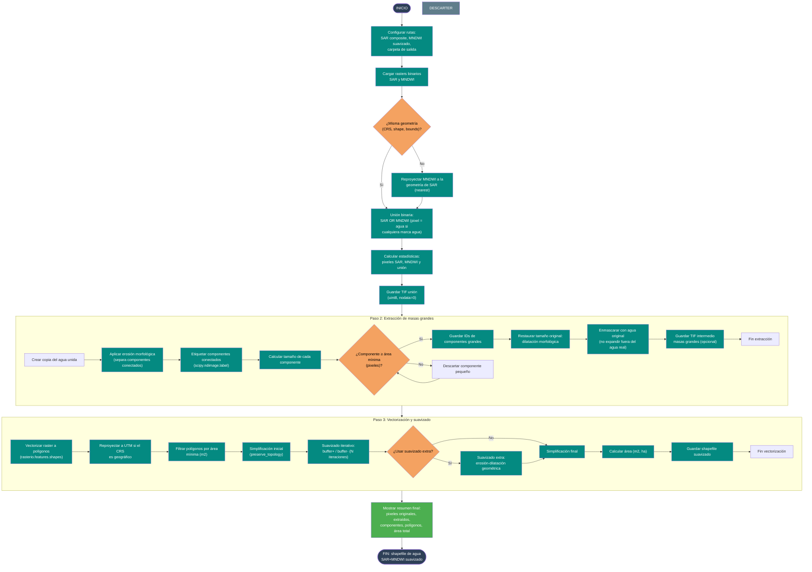

# 06 — Unión MNDWI + SAR + extracción de masas de agua

Documenta el flujo del script
[`Codigos/06_UNIR_MNDWI_SAR.py`](../Codigos/06_UNIR_MNDWI_SAR.py),
que combina los resultados binarios del [diagrama 05](./05_descarga_imagen_sar.md)
(Sentinel-1) y del [diagrama 04](./04_seleccion_mejores_imagenes.md) (MNDWI óptico),
extrae las masas de agua más grandes y genera un **shapefile suavizado** listo
para análisis cartográfico.

---

## Resumen del proceso

1. **Unión binaria:** aplicar OR lógico entre el raster SAR y el raster MNDWI
   suavizado. Si cualquiera de los dos marca agua en un píxel, el resultado es
   agua (1).
2. **Extracción de masas grandes:**
   - Erosión morfológica para separar componentes conectados.
   - Etiquetado de componentes y filtrado por área mínima en píxeles.
   - Dilatación para restaurar el tamaño original de los componentes que
     sobreviven el filtro.
3. **Vectorización y suavizado:**
   - Convertir el raster filtrado a polígonos.
   - Reproyectar a UTM si es necesario.
   - Filtrar por área mínima en metros cuadrados.
   - Suavizado iterativo (buffer positivo + negativo).
   - Suavizado extra opcional con erosión-dilatación geométrica.
   - Simplificación final y guardado del shapefile.

---

## Diagrama de flujo

> 📝 **Fuente editable:** [`06_unir_mndwi_sar.mmd`](./06_unir_mndwi_sar.mmd)



---

## Estrategia de unión SAR + MNDWI

Cada sensor tiene fortalezas diferentes:

| Sensor | Ventaja | Debilidad |
|---|---|---|
| **MNDWI (óptico)** | Alta resolución espacial (10–30 m), buena discriminación agua/vegetación | Nubes, sombras, gaps temporales |
| **SAR (radar)** | Penetra nubes, activo día y noche, sensible a textura de superficie | Ruido speckle, confusión con suelo liso |

La **unión OR** maximiza la cobertura: si el óptico falla por nubes, el radar
puede detectar el agua; si el radar tiene ambigüedad, el óptico clarifica.

---

## Extracción de masas grandes

El objetivo es eliminar **falsos positivos pequeños** (charcos, sombras,
artefactos de clasificación) sin perder la forma de los cuerpos de agua reales.

La técnica de **erosión → etiquetado → filtro → dilatación** es clásica en
morfología matemática:

1. La **erosión** encoge cada componente y desconecta masas apenas unidas por
   puentes delgados.
2. El **etiquetado** identifica cada componente como un objeto independiente.
3. El **filtro por área** descarta los objetos pequeños.
4. La **dilatación** restaura el tamaño aproximado de los objetos conservados.
5. La **máscara con agua original** evita que la dilatación cree agua donde no
   existía en la unión original.

---

## Suavizado geométrico

Los bordes de los polígonos vectorizados desde raster son **escalonados**
(pixelados). El suavizado iterativo con buffer+ / buffer- redondea las esquinas
sin cambiar drásticamente el área total:

| Parámetro | Efecto | Valor típico |
|---|---|---|
| `ITERACIONES_SUAVIZADO` | Número de ciclos buffer+/- | 8 |
| `BUFFER_POR_ITERACION` | Distancia de cada buffer (m) | 10 |
| `SIMPLIFY_INICIAL` | Reducción de vértices previa (m) | 3 |
| `SIMPLIFY_FINAL` | Reducción de vértices final (m) | 5 |

El suavizado extra con erosión-dilatación geométrica (`buffer(-x)` luego
`buffer(+x)`) elimina **espigas y salientes** sin redondear excesivamente.

---

## Parámetros configurables

```python
ruta_sar    = r"...\S1_ASCENDING_..._MERGE.tif"
ruta_mndwi  = r"...\final_MNDWI_binario_freq2_suavizado.tif"
carpeta_salida = r"...\UNION_SAR_MNDWI"

ITERACIONES_EROSION     = 1
AREA_MINIMA_PIXELES     = 200
GUARDAR_TIF_INTERMEDIO  = True

MIN_AREA_M2             = 1000
ITERACIONES_SUAVIZADO   = 8
BUFFER_POR_ITERACION    = 10
SIMPLIFY_INICIAL        = 3.0
SIMPLIFY_FINAL          = 5.0
USAR_SUAVIZADO_EXTRA    = True
BUFFER_SUAVIZADO_EXTRA  = 5.0
```

---

## Salidas generadas

```
<DIR_SALIDA>/
├── union_SAR_MNDWI_binario.tif
├── masas_agua_grandes_area{AREA_MINIMA_PIXELES}.tif
└── union_SAR_MNDWI_suavizado.shp
```

---

## Dependencias

```python
import os, numpy as np, rasterio
from rasterio.warp import reproject, Resampling
from scipy import ndimage
import geopandas as gpd
from rasterio.features import shapes as rio_shapes
```

---

## Insumos esperados

| Origen | Archivo | Uso |
|---|---|---|
| [Diagrama 05](./05_descarga_imagen_sar.md) | `S1_..._MERGE.tif` (banda VV) | Raster SAR binario o composite. |
| [Diagrama 04](./04_seleccion_mejores_imagenes.md) | `final_MNDWI_binario_freq2_suavizado.tif` | Raster MNDWI binario suavizado. |

---

## Edición visual del diagrama

1. **[mermaid.live](https://mermaid.live)** — copiar/pegar el `.mmd`.
2. **[Mermaid Chart](https://www.mermaidchart.com)** — drag & drop.
3. **VS Code** + extensión `tomoyukim.vscode-mermaid-editor`.

Tras editar, sincroniza con:

```bash
python scripts/sync_mmd.py diagramas/06_unir_mndwi_sar.mmd
```

---

## Changelog

| Fecha | Cambio |
|---|---|
| 2026-05-27 | Creación inicial |
