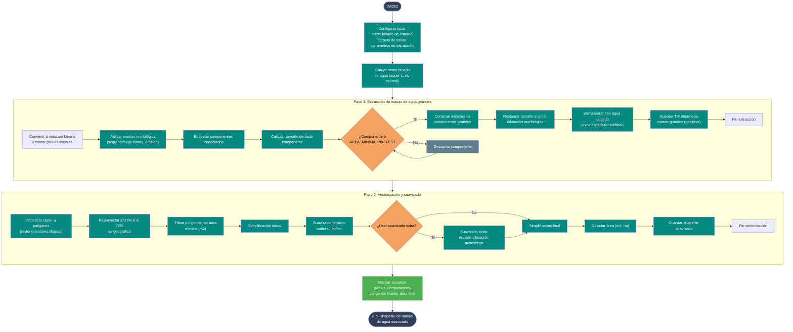

# 07 — Extracción de masas de agua grandes + vectorización

Documenta el flujo del script
[`Codigos/07_EXTRAER_MAS_AGUA.py`](../Codigos/07_EXTRAER_MAS_AGUA.py),
que toma un **raster binario de agua** (puede ser la salida del
[diagrama 06](./06_unir_mndwi_sar.md) o cualquier otro binario) y genera un
**shapefile suavizado** con las masas de agua más grandes, filtrando ruido y
artefactos pequeños.

Esencialmente es el **Paso 2 y 3 del diagrama 06** como script independiente,
útil cuando ya se tiene un raster binario de agua y solo se necesita
vectorizarlo y suavizarlo.

---

## Resumen del proceso

1. **Cargar** el raster binario de entrada.
2. **Extracción de masas grandes:**
   - Erosión morfológica para separar componentes.
   - Etiquetado de componentes conectados.
   - Filtrado por área mínima en píxeles.
   - Dilatación para restaurar tamaño original.
   - Guardar TIF intermedio opcional.
3. **Vectorización y suavizado:**
   - Vectorizar a polígonos.
   - Reproyectar a UTM si es necesario.
   - Filtrar por área mínima en m².
   - Simplificación + suavizado iterativo + suavizado extra opcional.
   - Guardar shapefile final.

---

## Diagrama de flujo

> 📝 **Fuente editable:** [`07_extraer_mas_agua.mmd`](./07_extraer_mas_agua.mmd)



---

## Diferencias con el diagrama 06

| Aspecto | Diagrama 06 | Diagrama 07 |
|---|---|---|
| Entrada | Dos rasters (SAR + MNDWI) | Un raster binario cualquiera |
| Paso 1 | Unión OR + extracción | Solo extracción |
| Uso típico | Fusionar sensores | Vectorizar un binario existente |

El diagrama 07 es útil cuando se quiere **refinar un shapefile** a partir de un
raster binario ya generado por otro método.

---

## Parámetros configurables

```python
RUTA_ENTRADA = r"...\union_SAR_MNDWI_binario.tif"
CARPETA_SALIDA = os.path.dirname(RUTA_ENTRADA)

ITERACIONES_EROSION   = 1
AREA_MINIMA_PIXELES   = 20
GUARDAR_TIF_INTERMEDIO = True

MIN_AREA_M2           = 10
ITERACIONES_SUAVIZADO = 1
BUFFER_POR_ITERACION  = 1
SIMPLIFY_INICIAL      = 1.0
SIMPLIFY_FINAL        = 5.0
USAR_SUAVIZADO_EXTRA  = True
BUFFER_SUAVIZADO_EXTRA = 1
```

Los valores por defecto en el 07 son **mucho más permisivos** que en el 06
(área mínima de 20 px vs 200 px), porque está pensado para trabajar con el
raster unido ya filtrado, o para capturar cuerpos de agua más pequeños.

---

## Salidas generadas

```
<CARPETA_SALIDA>/
├── masas_agua_grandes_area{AREA_MINIMA_PIXELES}.tif
└── union_SAR_MNDWI_suavizado.shp
```

---

## Dependencias

```python
import os, numpy as np, rasterio
from scipy import ndimage
import geopandas as gpd
from rasterio.features import shapes as rio_shapes
```

---

## Insumos esperados

| Origen | Archivo | Uso |
|---|---|---|
| [Diagrama 06](./06_unir_mndwi_sar.md) (o cualquier binario) | Raster binario de agua (0/1) | Entrada para extracción y vectorización. |

---

## Edición visual del diagrama

1. **[mermaid.live](https://mermaid.live)** — copiar/pegar el `.mmd`.
2. **[Mermaid Chart](https://www.mermaidchart.com)** — drag & drop.
3. **VS Code** + extensión `tomoyukim.vscode-mermaid-editor`.

Tras editar, sincroniza con:

```bash
python scripts/sync_mmd.py diagramas/07_extraer_mas_agua.mmd
```
