# 08 — Análisis geomorfológico (DEM + HAND + TWI + mapas)

Documenta el flujo del script
[`Codigos/08_GEOMORFOLOGICO.py`](../Codigos/08_GEOMORFOLOGICO.py),
el script más grande del repositorio. Descarga o usa un DEM de alta resolución,
genera un **microrelieve exagerado**, calcula **HAND** (Height Above Nearest
Drainage) y **TWI** (Topographic Wetness Index), clasifica zonas de
inundabilidad en 9 niveles, y produce **mapas cartográficos de publicación**
con grilla MAGNA-SIRGAS, flecha norte, barra de escala y leyendas.

---

## Resumen del proceso

1. **Fuente del DEM:** usa un DEM local de 12 m si existe; si no, descarga
   hasta 4 DEMs globales desde GEE (Copernicus GLO-30, NASADEM, ALOS AW3D30,
   SRTM GL1) y selecciona uno.
2. **Microrelieve exagerado:** limpia anomalías, rellena huecos, suaviza con
   gaussiano, resta al original, exagera ×10 y suma al suavizado.
3. **HAND + TWI:** con WhiteboxTools calcula dirección de flujo D8,
   acumulación, red de drenaje, pendiente, HAND y TWI. Normaliza y combina
   ambos índices con pesos en un índice de inundabilidad continuo, clasificado
   en 9 clases.
4. **Gráficos cartográficos:** genera mapas individuales de pendiente,
   acumulación, red de drenaje, HAND y zonas de inundación, cada uno con
   hillshade, grilla EPSG:9377, flecha norte y barra de escala. También un
   mapa compuesto 2×2.
5. **Mapa tipo de relieve (opcional):** lee una GDB geomorfológica y la
   superpone sobre el DEM con paleta por tipo de relieve.

---

## Diagrama de flujo

> 📝 **Fuente editable:** [`08_geomorfologico.mmd`](./08_geomorfologico.mmd)

```mermaid
flowchart TD
    START([INICIO]) --> CFG

    CFG["Configurar rutas base,<br/>shapefiles AOI e hidrológico,<br/>proyecto GEE,<br/>parámetros gráficos"] --> DEM

    subgraph DEM ["Paso 1: Fuente del DEM"]
      D1{"¿Existe DEM local<br/>de alta resolución?"} -->|"Sí"| D2
      D1 -->|"No"| D3
      D2["Usar DEM local<br/>(omitir descarga GEE)"] --> FIN_DEM
      D3["Inicializar GEE"] --> D4
      D4["Cargar shapefile AOI<br/>y crear región con buffer"] --> D5
      D5["Descargar 4 DEMs desde GEE:<br/>• Copernicus GLO-30<br/>• NASADEM<br/>• ALOS AW3D30<br/>• SRTM GL1"] --> D6
      D6["Seleccionar DEM para análisis<br/>(por defecto Copernicus)"] --> FIN_DEM
      FIN_DEM["DEM listo"]
    end

    DEM --> MICRO

    subgraph MICRO ["Paso 2: Microrelieve exagerado"]
      M1["Leer DEM crudo"] --> M2
      M2["Limpiar anomalías:<br/>nodata, ceros, negativos,<br/>outliers (>3σ)"] --> M3
      M3["Rellenar huecos<br/>(rasterio.fillnodata)"] --> M4
      M4["Suavizado gaussiano<br/>(sigma=7 px)"] --> M5
      M5["Calcular microrelieve:<br/>DEM - suavizado"] --> M6
      M6["Exagerar ×10 y sumar<br/>al suavizado"] --> M7
      M7["Clampear negativos a 0"] --> M8
      M8["Guardar DEM microrelieve"] --> FIN_MICRO
      FIN_MICRO["Microrelieve listo"]
    end

    MICRO --> HAND_TWI

    subgraph HAND_TWI ["Paso 3: HAND + TWI — Zonas de inundación"]
      H1["Rellenar depresiones<br/>(WhiteboxTools)"] --> H2
      H2["Dirección de flujo D8"] --> H3
      H3["Acumulación de flujo D8"] --> H4
      H4["Extraer red de drenaje<br/>(umbral acumulación)"] --> H5
      H5["Calcular pendiente (grados)"] --> H6
      H6["Calcular HAND<br/>(altura sobre drenaje)"] --> H7
      H7["Calcular TWI<br/>(índice de humedad)"] --> H8
      H8["Normalizar HAND y TWI<br/>y combinar con pesos"] --> H9
      H9["Aplicar máscara de pendiente<br/>máxima inundable"] --> H10
      H10["Clasificar en 9 clases<br/>de inundabilidad"] --> H11
      H11{"¿Suavizar resultado?"} -->|"Sí"| H12
      H11 -->|"No"| H13
      H12["Suavizado morfológico<br/>(closing + opening)"] --> H13
      H13["Guardar clasificación + índice continuo"] --> H14
      H14["Generar leyenda QGIS (.qml)"] --> FIN_HAND
      FIN_HAND["HAND/TWI listo"]
    end

    HAND_TWI --> GRAFICOS

    subgraph GRAFICOS ["Paso 4: Generación de gráficos cartográficos"]
      G1["Cargar capa de referencia<br/>hidrológica"] --> G2
      G2["Calcular extent de zoom<br/>con buffer alrededor del hidrológico"] --> G3
      G3["Para cada raster config:<br/>slope, flow accumulation,<br/>streams, HAND, zonas"] --> G4
      G4["Generar mapa individual<br/>con hillshade, grilla MAGNA-SIRGAS,<br/>flecha norte, barra escala,<br/>límite hidrológico"] --> G5
      G5{"¿Más rasters?"} -->|"Sí"| G4
      G5 -->|"No"| G6
      G6["Generar mapa compuesto 2×2"] --> FIN_GRAF
      FIN_GRAF["Gráficos listos"]
    end

    GRAFICOS --> RELIEVE

    subgraph RELIEVE ["Paso 4B: Mapa tipo de relieve (GDB)"]
      R1{"¿Existe GDB de relieve?"} -->|"Sí"| R2
      R1 -->|"No"| FIN_RELIEVE
      R2["Leer capa de tipos de relieve"] --> R3
      R3["Reproyectar al CRS del DEM"] --> R4
      R4["Asignar paleta por tipo"] --> R5
      R5["Dibujar sobre DEM hillshade<br/>con transparencia"] --> R6
      R6["Resaltar unidades inundables<br/>en azul/cian"] --> R7
      R7["Guardar mapa tipo de relieve"] --> FIN_RELIEVE
      FIN_RELIEVE["Relieve opcional listo"]
    end

    RELIEVE --> END_NODE
    END_NODE([FIN: DEM, HAND/TWI,<br/>mapas cartográficos y QML generados])

    style START     fill:#2E4057,color:#fff
    style END_NODE  fill:#2E4057,color:#fff

    style CFG       fill:#048A81,color:#fff
    style D2        fill:#048A81,color:#fff
    style D3        fill:#048A81,color:#fff
    style D4        fill:#048A81,color:#fff
    style D5        fill:#048A81,color:#fff
    style D6        fill:#048A81,color:#fff
    style M1        fill:#048A81,color:#fff
    style M2        fill:#048A81,color:#fff
    style M3        fill:#048A81,color:#fff
    style M4        fill:#048A81,color:#fff
    style M5        fill:#048A81,color:#fff
    style M6        fill:#048A81,color:#fff
    style M7        fill:#048A81,color:#fff
    style M8        fill:#048A81,color:#fff
    style H1        fill:#048A81,color:#fff
    style H2        fill:#048A81,color:#fff
    style H3        fill:#048A81,color:#fff
    style H4        fill:#048A81,color:#fff
    style H5        fill:#048A81,color:#fff
    style H6        fill:#048A81,color:#fff
    style H7        fill:#048A81,color:#fff
    style H8        fill:#048A81,color:#fff
    style H9        fill:#048A81,color:#fff
    style H10       fill:#048A81,color:#fff
    style H12       fill:#048A81,color:#fff
    style H13       fill:#048A81,color:#fff
    style H14       fill:#048A81,color:#fff
    style G1        fill:#048A81,color:#fff
    style G2        fill:#048A81,color:#fff
    style G4        fill:#048A81,color:#fff
    style G6        fill:#048A81,color:#fff
    style R2        fill:#048A81,color:#fff
    style R3        fill:#048A81,color:#fff
    style R4        fill:#048A81,color:#fff
    style R5        fill:#048A81,color:#fff
    style R6        fill:#048A81,color:#fff
    style R7        fill:#048A81,color:#fff

    style D1        fill:#F4A261,color:#000
    style H11       fill:#F4A261,color:#000
    style R1        fill:#F4A261,color:#000
    style G5        fill:#F4A261,color:#000

    style FIN_DEM   fill:#4CAF50,color:#fff
    style FIN_MICRO fill:#4CAF50,color:#fff
    style FIN_HAND  fill:#4CAF50,color:#fff
    style FIN_GRAF  fill:#4CAF50,color:#fff
    style FIN_RELIEVE fill:#4CAF50,color:#fff
```



---

## Fuentes de DEM disponibles

| Fuente | Resolución | Tecnología | Periodo | GEE ID |
|---|---|---|---|---|
| **Copernicus GLO-30** | 30 m | Radar TanDEM-X | 2011–2015 | `COPERNICUS/DEM/GLO30` |
| **NASADEM** | 30 m | SRTM reprocesado | 2000 | `NASA/NASADEM_HGT/001` |
| **ALOS AW3D30** | 30 m | Estéreo óptico | 2006–2011 | `JAXA/ALOS/AW3D30/V3_2` |
| **SRTM GL1** | 30 m | Radar C-band | 2000 | `USGS/SRTMGL1_003` |

---

## Clasificación HAND + TWI

El índice combinado se calcula como:

```
indice = 0.6 × HAND_norm + 0.4 × TWI_norm
```

Luego se aplica una máscara de pendiente máxima (por defecto 5°) y se
clasifica en 9 clases de inundabilidad:

| Clase | Nombre | Rango índice |
|---|---|---|
| 1 | Humedal seguro | > 0.9 |
| 2 | Muy inundable | 0.8 – 0.9 |
| 3 | Inundable alto | 0.7 – 0.8 |
| 4 | Inundable | 0.6 – 0.7 |
| 5 | Inundable moderado | 0.5 – 0.6 |
| 6 | Transición alta | 0.4 – 0.5 |
| 7 | Transición | 0.3 – 0.4 |
| 8 | Transición baja | 0.2 – 0.3 |
| 9 | Influencia | 0.1 – 0.2 |
| 0 | Barrera/Dique | < 0.1 o pendiente > 5° |

---

## Parámetros clave

```python
CARPETA_BASE    = r'F:\SYNC\ANT\...\LA CHIQUITA'
BUFFER_GEOMORFOLOGICO_M = 3000   # buffer DEM
BUFFER_ZOOM_MAPAS_M     = 1890   # buffer para gráficos
MAPA_DPI      = 180
MAPA_ANCHO_PX = 3200
MAPA_ALTO_PX  = 1800
DEM_SELECCIONADO = 'copernicus_dem_glo30_30m_buffer.tif'
```

---

## Dependencias

```python
import os, sys, numpy as np, rasterio
from rasterio.fill import fillnodata
from scipy.ndimage import gaussian_filter
from whitebox import WhiteboxTools
import matplotlib.pyplot as plt
import geopandas as gpd
import ee, geemap
```

---

## Insumos esperados

| Origen | Archivo | Uso |
|---|---|---|
| Usuario | Shapefile AOI + hidrológico | Región de análisis y referencia visual. |
| Usuario (opcional) | DEM local 12 m | Omite descarga GEE si existe. |
| Usuario (opcional) | GDB tipo de relieve | Mapa geomorfológico adicional. |

---

## Edición visual del diagrama

1. **[mermaid.live](https://mermaid.live)** — copiar/pegar el `.mmd`.
2. **[Mermaid Chart](https://www.mermaidchart.com)** — drag & drop.
3. **VS Code** + extensión `tomoyukim.vscode-mermaid-editor`.

Tras editar, sincroniza con:

```bash
python scripts/sync_mmd.py diagramas/08_geomorfologico.mmd
```

---

## Changelog

| Fecha | Cambio |
|---|---|
| 2026-05-27 | Creación inicial |
