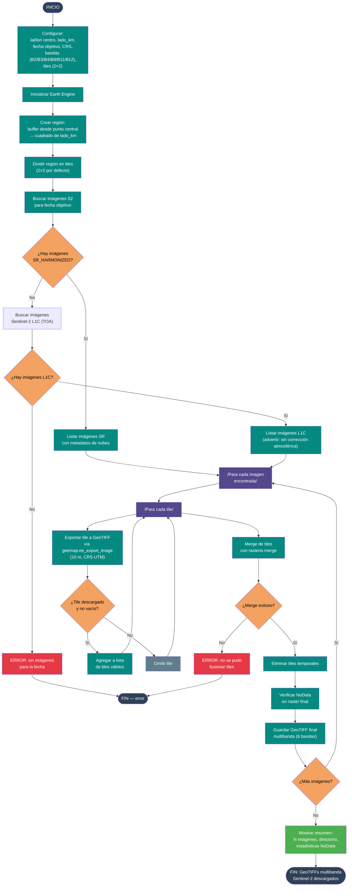

# 09 — Descarga de mosaico multibanda Sentinel-2

Documenta el flujo del script
[`Codigos/09. Descargar Multibanda S2.py`](../Codigos/09.%20Descargar%20Multibanda%20S2.py),
que descarga imágenes **Sentinel-2 multibanda** (6 bandas espectrales) para una
fecha específica identificada previamente, usando **descarga por tiles** para
evitar límites de tamaño de GEE.

---

## Resumen del proceso

1. **Configurar** región de interés (centro lat/lon + lado en km), fecha
   objetivo, CRS UTM, bandas y grilla de tiles (2×2 por defecto).
2. **Inicializar Earth Engine** y crear la región con buffer.
3. **Buscar imágenes** para la fecha exacta:
   - Primero en `COPERNICUS/S2_SR_HARMONIZED` (con corrección atmosférica).
   - Fallback a `COPERNICUS/S2` (L1C/TOA) si no hay SR.
4. **Descargar por tiles:** para cada imagen encontrada, exporta cada tile
   individualmente y luego los fusiona con `rasterio.merge`.
5. **Verificar** que el raster final no tenga NoData significativo.

---

## Diagrama de flujo

> 📝 **Fuente editable:** [`09_descargar_multibanda_s2.mmd`](./09_descargar_multibanda_s2.mmd)



---

## Bandas descargadas

| Banda | Nombre | Uso típico |
|---|---|---|
| B2 | Blue (490 nm) | Agua, aerosoles |
| B3 | Green (560 nm) | Vegetación saludable |
| B4 | Red (665 nm) | Clorofila, suelo |
| B8 | NIR (842 nm) | Biomasa, índices |
| B11 | SWIR1 (1610 nm) | Humedad del suelo |
| B12 | SWIR2 (2190 nm) | Minerales, quemado |

---

## Diferencia SR vs L1C

| Característica | SR (Surface Reflectance) | L1C (Top Of Atmosphere) |
|---|---|---|
| Corrección atmosférica | Sí | No |
| Valores | Reflectancia de superficie | Reflectancia TOA |
| Calidad | Mejor para clasificación | Aceptable si no hay SR |
| Disponibilidad | Menor (con nubes) | Mayor |

> El script advierte explícitamente cuando usa L1C para que el usuario lo tenga
> en cuenta en el análisis posterior.

---

## Parámetros configurables

```python
latitud      = 8.729069
longitud     = -75.909675
lado_km      = 4
CRS_EXPORTACION = 'EPSG:32618'
FECHA_OBJETIVO = '2025-12-06'
UMBRAL_NUBES_ESCENA = 50
UMBRAL_NUBES_LOCAL  = 32
bandas_s2 = ['B2','B3','B4','B8','B11','B12']
TILES_COLS = 2
TILES_FILAS = 2
```

---

## Salidas generadas

```
<DIRECTORIO_SALIDA>/
├── S2_2025-12-06_T18PUQ_SR.tif   ← ejemplo con SR
└── S2_2025-12-06_T18PUQ_TOA.tif  ← ejemplo con L1C (si fallback)
```

---

## Dependencias

```python
import ee, geemap, os, sys, rasterio, numpy as np
from rasterio.merge import merge
from datetime import datetime, timedelta
```

---

## Insumos esperados

| Origen | Dato | Uso |
|---|---|---|
| Usuario | Lat/lon centro + lado_km | Define el área de estudio. |
| Usuario | Fecha objetivo | Fecha exacta de la imagen deseada. |

---

## Edición visual del diagrama

1. **[mermaid.live](https://mermaid.live)** — copiar/pegar el `.mmd`.
2. **[Mermaid Chart](https://www.mermaidchart.com)** — drag & drop.
3. **VS Code** + extensión `tomoyukim.vscode-mermaid-editor`.

Tras editar, sincroniza con:

```bash
python scripts/sync_mmd.py diagramas/09_descargar_multibanda_s2.mmd
```

---

## Changelog

| Fecha | Cambio |
|---|---|
| 2026-05-27 | Creación inicial |
