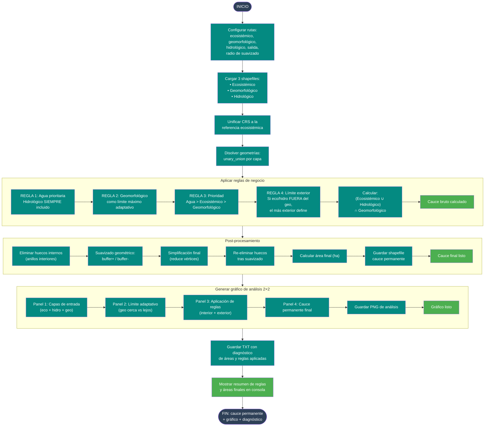

# 11 — Unión de componentes: cauce permanente preliminar

Documenta el flujo del script
[`Codigos/11 .UNIR_COMPONENTES.py`](../Codigos/11%20.UNIR_COMPONENTES.py),
que combina tres capas vectoriales (ecosistémica, geomorfológica e
hidrológica) mediante **reglas de negocio explícitas** para generar un
**polígono de cauce permanente preliminar**, suavizado y listo para revisión.

---

## Resumen del proceso

1. **Cargar** las tres capas de entrada y unificar CRS.
2. **Aplicar reglas de negocio:**
   - **Regla 1 (Agua prioritaria):** el componente hidrológico siempre se
     incluye completo.
   - **Regla 2 (Geomorfológico adaptativo):** el geomorfológico actúa como
     límite máximo, pero solo cuando está cerca de los otros componentes.
   - **Regla 3 (Prioridad):** Hidrológico > Ecosistémico > Geomorfológico.
   - **Regla 4 (Límite exterior):** si eco o hidro quedan fuera del geo, el
     límite es el más exterior de ellos (no el geomorfológico).
3. **Post-procesamiento:** eliminar huecos internos, suavizar geométricamente,
   simplificar y recalcular áreas.
4. **Generar gráfico de análisis 2×2** que muestra: capas de entrada, límite
   adaptativo, aplicación de reglas y cauce final.
5. **Guardar shapefile, PNG y TXT** con diagnóstico completo.

---

## Diagrama de flujo

> 📝 **Fuente editable:** [`11_unir_componentes.mmd`](./11_unir_componentes.mmd)



---

## Reglas de negocio en detalle

| Regla | Descripción | Fórmula geométrica |
|---|---|---|
| **1** | El agua (hidrológico) siempre está dentro del cauce final. | `Hidro ⊂ Cauce` |
| **2** | El geomorfológico es límite máximo solo cuando está cerca. | `Geo ∩ (Eco ∪ Hidro)` |
| **3** | Prioridad: agua > ecosistémico > geomorfológico. | Orden de decisión |
| **4** | Si eco/hidro se salen del geo, el más exterior gana. | `Cauce = (Eco ∪ Hidro) ∩ Geo` con excepciones |

La fórmula final implementada es:

```
Cauce = (Ecosistémico ∪ Hidrológico) ∩ Geomorfológico
```

Con la **Regla 4** como excepción automática cuando hay componentes fuera del
geomorfológico.

---

## Parámetros configurables

```python
RADIO_SUAVIZADO_GEO     = 15   # metros
TOLERANCIA_SIMPLIFY_GEO = 5    # metros
RADIO_SUAVIZADO         = 15   # metros
TOLERANCIA_SIMPLIFY     = 5    # metros
```

---

## Salidas generadas

```
<CARPETA_SALIDA>/
├── cauce_permanente_reglas.shp
├── analisis_cauce_reglas.png   ← gráfico 2×2
└── diagnostico_reglas.txt      ← áreas y reglas aplicadas
```

---

## Dependencias

```python
import geopandas as gpd, os, numpy as np
import matplotlib.pyplot as plt
from matplotlib.patches import Patch
from shapely.ops import unary_union
from shapely.geometry import MultiPolygon, Polygon
```

---

## Insumos esperados

| Origen | Archivo | Uso |
|---|---|---|
| [Diagrama 10](./10_coberturas.md) | `coberturas.shp` (ciénagas) | Componente ecosistémico. |
| [Diagrama 08](./08_geomorfologico.md) | `poligono_geomorfologico_...shp` | Componente geomorfológico. |
| Usuario | `HIDROLOGICO.shp` | Componente hidrológico (límite de agua). |

---

## Edición visual del diagrama

1. **[mermaid.live](https://mermaid.live)** — copiar/pegar el `.mmd`.
2. **[Mermaid Chart](https://www.mermaidchart.com)** — drag & drop.
3. **VS Code** + extensión `tomoyukim.vscode-mermaid-editor`.

Tras editar, sincroniza con:

```bash
python scripts/sync_mmd.py diagramas/11_unir_componentes.mmd
```

---

## Changelog

| Fecha | Cambio |
|---|---|
| 2026-05-27 | Creación inicial |
