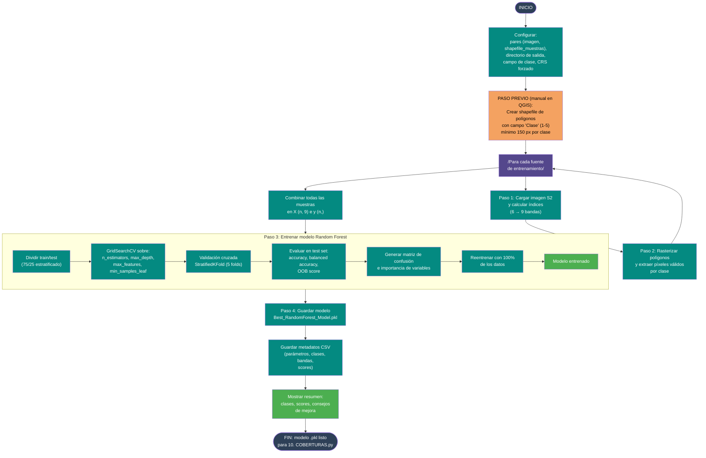

# 12 — Entrenamiento de modelo Random Forest para coberturas

Documenta el flujo del script
[`Codigos/12. ENTRENAR_MODELO_COBERTURAS.py`](../Codigos/12.%20ENTRENAR_MODELO_COBERTURAS.py),
que entrena un **clasificador Random Forest** para asignar clases CORINE Land
Cover a píxeles de Sentinel-2, usando **validación cruzada estratificada** y
**búsqueda de hiperparámetros**.

---

## Resumen del proceso

1. **Paso previo (manual en QGIS):** crear un shapefile de polígonos de
   entrenamiento con un campo `Clase` (1–5) y distribuir muchos polígonos
   pequeños por toda la imagen.
2. **Paso 1:** cargar cada imagen Sentinel-2 de 6 bandas, aplicar factor de
   escala y calcular NDVI, MNDWI y NDBI → 9 bandas en memoria.
3. **Paso 2:** rasterizar los polígonos de entrenamiento y extraer los valores
   de píxel para cada clase.
4. **Paso 3:** entrenar un Random Forest con `GridSearchCV` sobre
   `n_estimators`, `max_depth`, `max_features` y `min_samples_leaf`. Usar
   `class_weight='balanced'` para compensar desbalance. Evaluar con
   `StratifiedKFold`, accuracy test y OOB score.
5. **Paso 4:** guardar el modelo entrenado como `.pkl` y metadatos como CSV.

---

## Diagrama de flujo

> 📝 **Fuente editable:** [`12_entrenar_modelo_coberturas.mmd`](./12_entrenar_modelo_coberturas.mmd)



---

## Tips para un buen entrenamiento

- **Mínimo 150 píxeles por clase** (ideal 500–1000).
- **Distribuir polígonos por toda la imagen**, no solo en una zona.
- **Evitar bordes** entre clases (píxeles mixtos contaminan).
- **Incluir nubes gruesas, delgadas y bordes** como clase aparte si es
  necesario.
- El script usa `class_weight='balanced'` y `StratifiedKFold`, pero si una
  clase tiene < 50 píxeles, agrega más muestras.

---

## Clases del modelo

| Código | Clase CORINE |
|---|---|
| 1 | 3.1.1 Bosque denso |
| 2 | 1.1.2 Tejido urbano discontinuo |
| 3 | 5.1.1 Ríos y corrientes de agua |
| 4 | 4.1.1 Humedales |
| 5 | 3.3.2 Zonas desnudas o degradadas |

---

## Parámetros de entrenamiento

```python
SCALE_FACTOR   = 0.0001
TEST_SIZE      = 0.25
N_FOLDS        = 5
RANDOM_STATE   = 42

# GridSearchCV
n_estimators   = [200, 400]
max_depth      = [None, 30]
max_features   = ['sqrt', 0.5]
min_samples_leaf = [1, 3]
```

---

## Salidas generadas

```
<OUTPUT_DIR>/
├── Best_RandomForest_Model.pkl
├── Model_Metadata.csv
├── Confusion_Matrix.png
└── Feature_Importance.png
```

---

## Dependencias

```python
import numpy as np, rasterio, geopandas as gpd, joblib, pandas as pd
from rasterio.features import rasterize
from sklearn.ensemble import RandomForestClassifier
from sklearn.model_selection import StratifiedKFold, GridSearchCV, train_test_split
from sklearn.metrics import accuracy_score, classification_report, confusion_matrix
import matplotlib.pyplot as plt, seaborn as sns
```

---

## Insumos esperados

| Origen | Archivo | Uso |
|---|---|---|
| Usuario (QGIS) | Shapefile de muestras con campo `Clase` | Entrenamiento supervisado. |
| [Diagrama 09](./09_descargar_multibanda_s2.md) | GeoTIFF multibanda S2 (6 bandas) | Imagen de donde extraer píxeles. |

---

## Edición visual del diagrama

1. **[mermaid.live](https://mermaid.live)** — copiar/pegar el `.mmd`.
2. **[Mermaid Chart](https://www.mermaidchart.com)** — drag & drop.
3. **VS Code** + extensión `tomoyukim.vscode-mermaid-editor`.

Tras editar, sincroniza con:

```bash
python scripts/sync_mmd.py diagramas/12_entrenar_modelo_coberturas.mmd
```

---

## Changelog

| Fecha | Cambio |
|---|---|
| 2026-05-27 | Creación inicial |
