# 13 — Salidas gráficas para informe

Documenta el flujo del script
[`Codigos/13. SALIDAS_GRAFICAS_INFORME.py`](../Codigos/13.%20SALIDAS_GRAFICAS_INFORME.py),
que genera **cuatro tipos de visualizaciones cartográficas** listas para
incluir en un informe técnico: mosaicos IR, mosaicos MNDWI, mapa de frecuencia
de agua y mapa de clasificación SAR.

Todas las salidas incluyen **grilla de coordenadas EPSG:9377** (CTM-12, Origen
Nacional Colombia), **flecha de norte**, **leyendas** y formato horizontal.

---

## Resumen del proceso

1. **Mosaicos IR:** lee los TIFs de la carpeta IR (falso color NIR-Red-Green),
   los ordena por año/misión, y genera mosaicos 2×5 con borde glow del
   shapefile AOI, grilla y norte pequeño.
2. **Mosaicos MNDWI:** igual estructura que IR pero con colormap `BrBG`,
   colorbar horizontal y leyenda tierra/agua.
3. **Mapa frecuencia de agua:** lee `Frecuencia_Total_MNDWI.tif`, ajusta
   viewport horizontal, dibuja límite AOI, grilla EPSG:9377, norte y
   convenciones.
4. **Mapa clasificación SAR:** lee el raster SAR composite, clasifica
   binariamente sobre la marcha (VV < umbral dB), superpone sobre backscatter
   en escala de grises, y genera mapa con estadísticas.

---

## Diagrama de flujo

> 📝 **Fuente editable:** [`13_salidas_graficas_informe.mmd`](./13_salidas_graficas_informe.mmd)

```mermaid
flowchart TD
    START([INICIO]) --> CFG

    CFG["Configurar:<br/>carpeta salida, shapefile AOI,<br/>rutas IR, MNDWI, frecuencia, SAR,<br/>estilos de borde, buffer"] --> MOSAICO_IR

    subgraph MOSAICO_IR ["1/4 — Mosaicos IR"]
      I1["Listar y ordenar TIFs IR<br/>por año y misión"] --> I2
      I2["Calcular número de<br/>mosaicos necesarios"] --> I3
      I3["/Para cada mosaico/"] --> I4
      I4["/Para cada celda/"] --> I5
      I5["Leer RGB con percent_clip<br/>y extent"] --> I6
      I6["Dibujar borde glow<br/>del shapefile AOI"] --> I7
      I7["Aplicar buffer ajustado<br/>a ratio de celda"] --> I8
      I8["Dibujar grilla EPSG:9377<br/>y norte pequeño"] --> I9
      I9["Agregar título<br/>(misión + año)"] --> I10
      I10{"¿Más celdas?"} -->|"Sí"| I4
      I10 -->|"No"| I11
      I11["Agregar leyenda y guardar<br/>PNG a 300 dpi"] --> FIN_IR
      FIN_IR["Mosaicos IR listos"]
    end

    MOSAICO_IR --> MOSAICO_MNDWI

    subgraph MOSAICO_MNDWI ["2/4 — Mosaicos MNDWI"]
      M1["Listar y ordenar TIFs MNDWI"] --> M2
      M2["/Para cada mosaico/"] --> M3
      M3["/Para cada celda/"] --> M4
      M4["Leer banda MNDWI,<br/>clip a rango [-1, 1]"] --> M5
      M5["Dibujar con cmap BrBG"] --> M6
      M6["Borde glow, buffer,<br/>grilla, norte, título"] --> M7
      M7{"¿Más celdas?"} -->|"Sí"| M3
      M7 -->|"No"| M8
      M8["Colorbar horizontal<br/>+ leyenda tierra/agua"] --> M9
      M9["Guardar PNG a 300 dpi"] --> FIN_MNDWI
      FIN_MNDWI["Mosaicos MNDWI listos"]
    end

    MOSAICO_MNDWI --> MAPA_FREQ

    subgraph MAPA_FREQ ["3/4 — Mapa frecuencia de agua"]
      F1["Leer raster Frecuencia_Total_MNDWI"] --> F2
      F2["Calcular vmax = max<br/>de frecuencia"] --> F3
      F3["Ajustar viewport<br/>a formato horizontal"] --> F4
      F4["Imshow con cmap GnBu"] --> F5
      F5["Dibujar límite AOI<br/>(blanco + negro)"] --> F6
      F6["Grilla EPSG:9377,<br/>norte, convenciones"] --> F7
      F7["Colorbar horizontal"] --> F8
      F8["Guardar PNG a 300 dpi"] --> FIN_FREQ
      FIN_FREQ["Mapa frecuencia listo"]
    end

    MAPA_FREQ --> MAPA_SAR

    subgraph MAPA_SAR ["4/4 — Mapa clasificación SAR"]
      S1["Leer raster SAR binario"] --> S2
      S2["Contar pixeles agua<br/>y no-agua"] --> S3
      S3["Crear RGBA:<br/>gris = no-agua, azul = agua"] --> S4
      S4["Fondo: backscatter SAR<br/>en escala de grises"] --> S5
      S5["Superponer clasificación<br/>binaria"] --> S6
      S6["Dibujar límite AOI,<br/>grilla, norte"] --> S7
      S7["Convenciones + estadísticas"] --> S8
      S8["Guardar PNG a 150 dpi"] --> FIN_SAR
      FIN_SAR["Mapa SAR listo"]
    end

    MAPA_SAR --> RESUMEN
    RESUMEN["Mostrar resumen:<br/>archivos generados,<br/>directorio de salida"] --> END_NODE

    END_NODE([FIN: mosaicos y mapas<br/>listos para informe])

    style START     fill:#2E4057,color:#fff
    style END_NODE  fill:#2E4057,color:#fff

    style CFG       fill:#048A81,color:#fff
    style I1        fill:#048A81,color:#fff
    style I2        fill:#048A81,color:#fff
    style I5        fill:#048A81,color:#fff
    style I6        fill:#048A81,color:#fff
    style I7        fill:#048A81,color:#fff
    style I8        fill:#048A81,color:#fff
    style I9        fill:#048A81,color:#fff
    style I11       fill:#048A81,color:#fff
    style M1        fill:#048A81,color:#fff
    style M4        fill:#048A81,color:#fff
    style M5        fill:#048A81,color:#fff
    style M6        fill:#048A81,color:#fff
    style M8        fill:#048A81,color:#fff
    style M9        fill:#048A81,color:#fff
    style F1        fill:#048A81,color:#fff
    style F2        fill:#048A81,color:#fff
    style F3        fill:#048A81,color:#fff
    style F4        fill:#048A81,color:#fff
    style F5        fill:#048A81,color:#fff
    style F6        fill:#048A81,color:#fff
    style F7        fill:#048A81,color:#fff
    style F8        fill:#048A81,color:#fff
    style S1        fill:#048A81,color:#fff
    style S2        fill:#048A81,color:#fff
    style S3        fill:#048A81,color:#fff
    style S4        fill:#048A81,color:#fff
    style S5        fill:#048A81,color:#fff
    style S6        fill:#048A81,color:#fff
    style S7        fill:#048A81,color:#fff
    style S8        fill:#048A81,color:#fff
    style RESUMEN   fill:#4CAF50,color:#fff

    style I3        fill:#54478C,color:#fff
    style I4        fill:#54478C,color:#fff
    style M2        fill:#54478C,color:#fff
    style M3        fill:#54478C,color:#fff

    style I10       fill:#F4A261,color:#000
    style M7        fill:#F4A261,color:#000

    style FIN_IR    fill:#4CAF50,color:#fff
    style FIN_MNDWI fill:#4CAF50,color:#fff
    style FIN_FREQ  fill:#4CAF50,color:#fff
    style FIN_SAR   fill:#4CAF50,color:#fff
```



---

## Elementos cartográficos comunes

| Elemento | Descripción |
|---|---|
| **Grilla EPSG:9377** | Líneas de coordenadas CTM-12 Origen Nacional con etiquetas |
| **Flecha norte** | Norte gráfico en esquina superior derecha |
| **Borde glow** | Límite del predio resaltado con halo cian/magenta |
| **Convenciones** | Leyenda con capas activas |
| **Formato horizontal** | Viewport más ancho que alto para informes |

---

## Parámetros de mosaico

```python
MOSAICO_COLUMNAS    = 5
MOSAICO_FILAS       = 2
MOSAICO_ANCHO_CELDA = 3.2   # pulgadas
MOSAICO_ALTO_CELDA  = 2.5
BUFFER_M = 600              # metros alrededor del AOI
```

---

## Salidas generadas

```
<RUTA_SALIDA>/
├── mosaico_IR_01.png
├── mosaico_IR_02.png  ← si hay >10 imágenes
├── mosaico_MNDWI_01.png
├── mapa_frecuencia_agua.png
└── mapa_clasificacion_SAR.png
```

---

## Dependencias

```python
import os, math, re, numpy as np, rasterio, geopandas as gpd
import matplotlib.pyplot as plt
from matplotlib.patches import Patch
from matplotlib.lines import Line2D
from rasterio.plot import plotting_extent
from pyproj import Transformer
```

---

## Insumos esperados

| Origen | Archivo | Uso |
|---|---|---|
| [Diagrama 04](./04_seleccion_mejores_imagenes.md) | TIFs IR por año | Mosaicos falso color. |
| [Diagrama 04](./04_seleccion_mejores_imagenes.md) | TIFs MNDWI por año | Mosaicos índice de agua. |
| [Diagrama 04](./04_seleccion_mejores_imagenes.md) | `Frecuencia_Total_MNDWI.tif` | Mapa de frecuencia. |
| [Diagrama 05](./05_descarga_imagen_sar.md) | `S1_..._MERGE.tif` | Mapa clasificación SAR. |
| Usuario | `HIDROLOGICO.shp` | Límite del área de estudio. |

---

## Edición visual del diagrama

1. **[mermaid.live](https://mermaid.live)** — copiar/pegar el `.mmd`.
2. **[Mermaid Chart](https://www.mermaidchart.com)** — drag & drop.
3. **VS Code** + extensión `tomoyukim.vscode-mermaid-editor`.

Tras editar, sincroniza con:

```bash
python scripts/sync_mmd.py diagramas/13_salidas_graficas_informe.mmd
```

---

## Changelog

| Fecha | Cambio |
|---|---|
| 2026-05-27 | Creación inicial |
