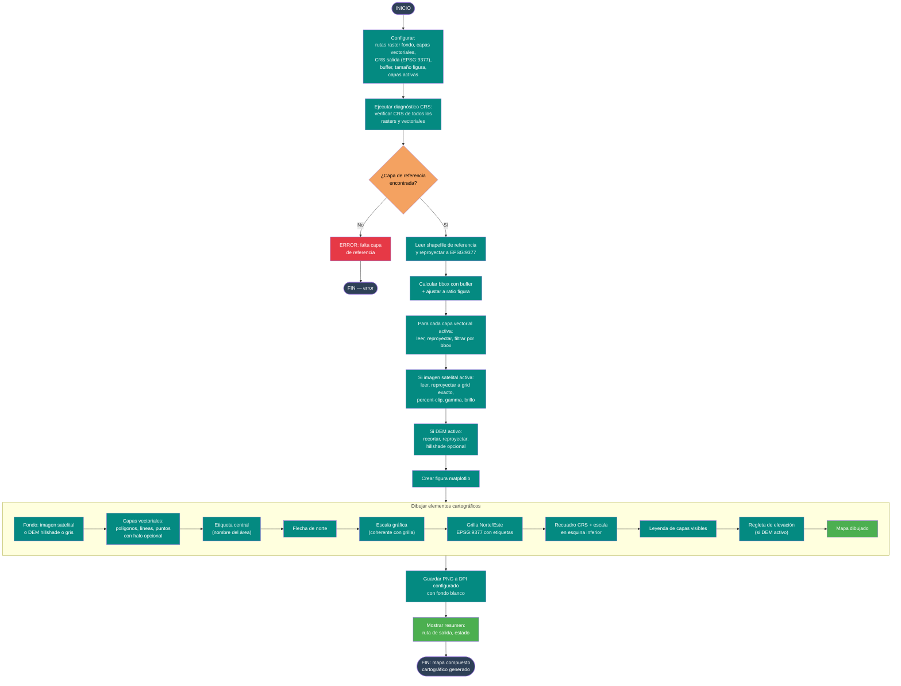

# 14 — Mapa compuesto cartográfico con Sentinel-2

Documenta el flujo del script
[`Codigos/14. salida_graficas_compuestas.py`](../Codigos/14.%20salida_graficas_compuestas.py),
una **plantilla extensible** para generar mapas compuestos de alta calidad con
imagen Sentinel-2 (o DEM) como fondo, capas vectoriales superpuestas, grilla de
coordenadas en **EPSG:9377** (MAGNA SIRGAS Origen Nacional), escala gráfica,
flecha de norte, leyenda y diagnóstico de CRS.

---

## Resumen del proceso

1. **Configurar** todas las rutas (raster fondo, DEM opcional, capas
   vectoriales, tamaño de figura, capas activas).
2. **Diagnóstico CRS:** verifica que todos los rasters y vectoriales tengan CRS
   definido y alerta si hay diferencias con respecto a EPSG:9377.
3. **Calcular extent:** lee la capa de referencia, aplica buffer y ajusta el
   bbox al ratio de la figura.
4. **Procesar raster de fondo:** lee, reproyecta al grid exacto del mapa,
   aplica percent-clip, gamma, brillo y desaturación.
5. **Procesar DEM opcional:** recorta, reproyecta, genera hillshade con
   LightSource.
6. **Cargar capas vectoriales:** lee cada capa activa, reproyecta a EPSG:9377,
   filtra por bbox.
7. **Dibujar:** fondo raster, DEM hillshade, capas vectoriales con halo,
   etiqueta central, flecha norte, escala gráfica, grilla EPSG:9377, recuadro
   CRS, leyenda y regleta de elevación.
8. **Guardar** PNG a DPI configurado.

---

## Diagrama de flujo

> 📝 **Fuente editable:** [`14_salidas_graficas_compuestas.mmd`](./14_salidas_graficas_compuestas.mmd)



---

## Capas vectoriales configurables

| N° | Capa | Tipo | Color típico |
|---|---|---|---|
| 1 | Hidrológico | Polígono | Azul brillante |
| 2 | Geomorfológico | Polígono | Naranja oscuro |
| 3 | Ecosistémico | Polígono | Verde oscuro |
| 4 | Cauce permanente | Polígono | Azul semi-transparente |
| 5 | Drenaje sencillo | Línea | Azul oscuro |
| 6 | Drenaje doble | Polígono | Azul oscuro |
| 7 | Municipios | Polígono | Negro (solo borde) |

---

## Parámetros clave

```python
EPSG_SALIDA = 9377          # MAGNA SIRGAS Origen Nacional
BUFFER_M    = 900           # metros
DPI_SALIDA  = 150
ANCHO_PX    = 2800
ALTO_PX     = 2400
BANDAS_RGB  = (6, 4, 1)     # B12, B8, B2 para cauce
# o (3, 2, 1) para RGB natural
GAMMA_RASTER   = 1.0
BRILLO_RASTER  = 0.0
DESAT_RASTER   = 0.0
DEM_HILLSHADE  = True
DEM_AZIMUTH    = 315
DEM_ALTITUD_LUZ = 40
```

---

## Salidas generadas

```
<DIR_SALIDA>/
└── MAPA_SENTINEL.png   ← o el nombre configurado
```

---

## Dependencias

```python
import geopandas as gpd, matplotlib.pyplot as plt
import matplotlib.patches as mpatches, matplotlib.lines as mlines
from matplotlib_scalebar.scalebar import ScaleBar
from pyproj import Transformer, CRS
import rasterio, numpy as np, os
```

---

## Insumos esperados

| Origen | Archivo | Uso |
|---|---|---|
| [Diagrama 09](./09_descargar_multibanda_s2.md) | GeoTIFF multibanda S2 | Fondo satelital. |
| [Diagrama 08](./08_geomorfologico.md) | DEM microrelieve | Fondo relieve opcional. |
| [Diagrama 11](./11_unir_componentes.md) | `cauce_permanente_reglas.shp` | Capa cauce permanente. |
| Usuario | GDB cartográfica (drenaje, municipios) | Contexto geográfico. |
| Usuario | `HIDROLOGICO.shp` | Capa de referencia para zoom. |

---

## Edición visual del diagrama

1. **[mermaid.live](https://mermaid.live)** — copiar/pegar el `.mmd`.
2. **[Mermaid Chart](https://www.mermaidchart.com)** — drag & drop.
3. **VS Code** + extensión `tomoyukim.vscode-mermaid-editor`.

Tras editar, sincroniza con:

```bash
python scripts/sync_mmd.py diagramas/14_salidas_graficas_compuestas.mmd
```

---

## Changelog

| Fecha | Cambio |
|---|---|
| 2026-05-27 | Creación inicial |
